## Supported Languages

DIDE currently supports the following languages for syntax highlighting:

| Category | Subtype         | Description |
|------|---------------|-------------------------------|
| HDL  | verilog       | Verilog hardware description language          |
|      | systemverilog | SystemVerilog hardware description language    |
|      | VHDL          | VHDL hardware description language             |
| TCL  | xdc           | Xilinx design constraint files          |
|      | sdc           | Synopsys design constraint files         |
|      | fdc           | FPGA design constraint files (including xdc, sdc, and fdc) |
| Other| ys            | Yosys synthesis script files |

## About Color Theme

In Vscode, the specific colors for syntax highlighting are defined by the Color Theme. The default theme in Vscode is `Dark+`, but we also use the `One Dark Pro` theme in our demonstration. These two themes, along with their corresponding light themes (`Light+` and `Atom One Light`), are the main color schemes we currently support. The One Dark Pro theme is fresh and ideal for those who value aesthetics, while the default `Dark+` theme is more standard and has a good contrast, making it suitable for developers who engage in long hours of intensive coding.

In addition to basic syntax highlighting, DIDE’s other features, such as documentation, VCD viewer, and netlist UI, all fully support the user’s selected Vscode theme color. There’s a theme for every taste—feel free to try out the one you like best!

## Color display

<Card title="Dark+ color display" icon="https://picx.zhimg.com/80/v2-d6eb33d06a512edcad625af79d5da7a4_1440w.png">

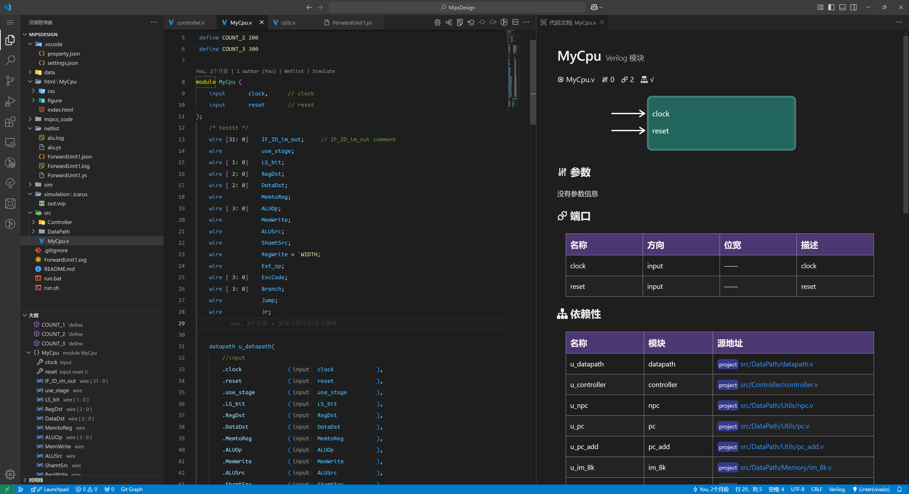

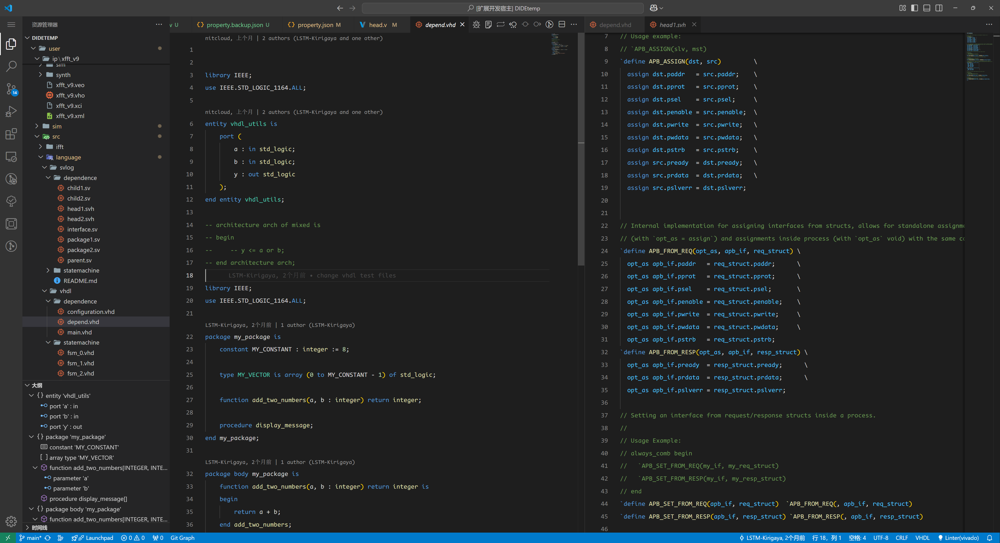

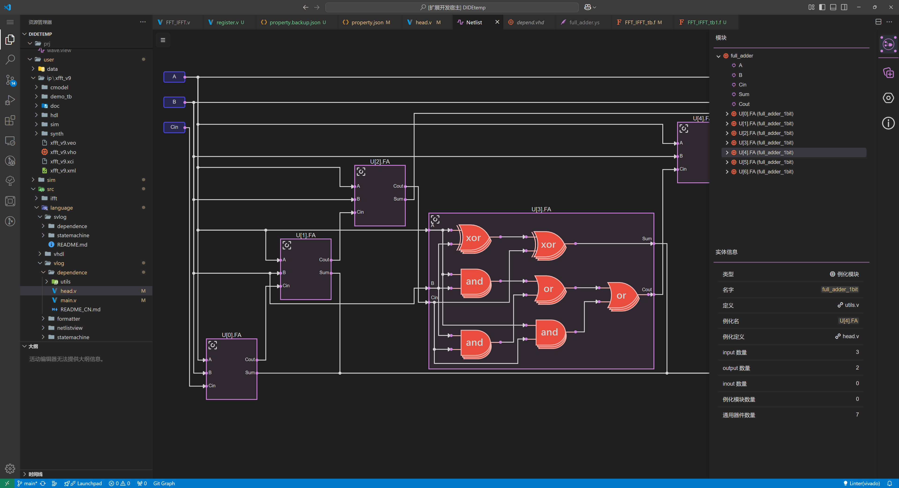

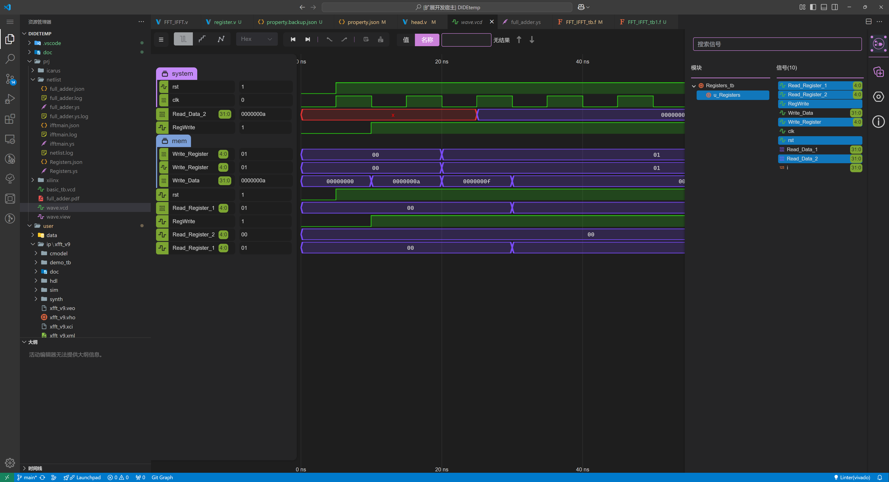

</Card>

<Card title="One Dark Pro color display" icon="https://picx.zhimg.com/80/v2-d6eb33d06a512edcad625af79d5da7a4_1440w.png">

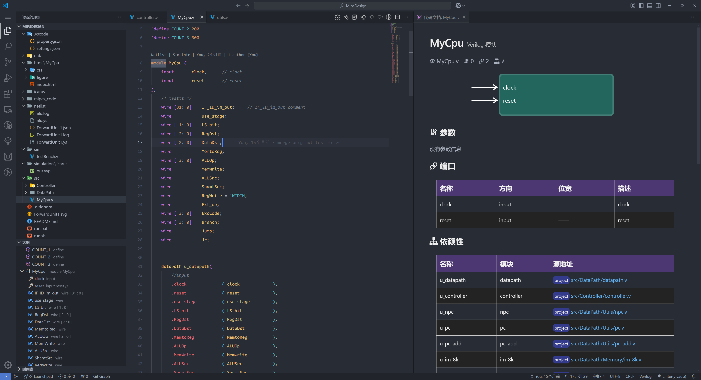

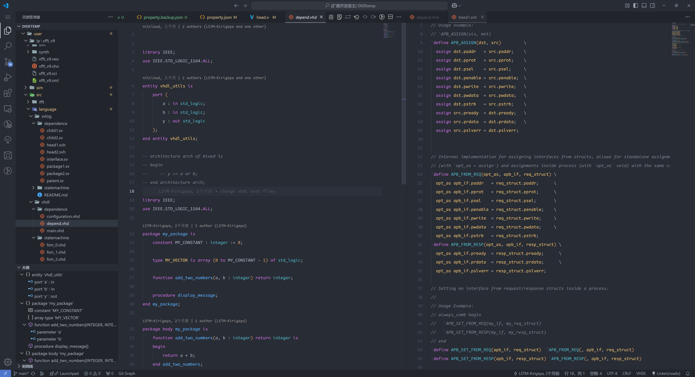

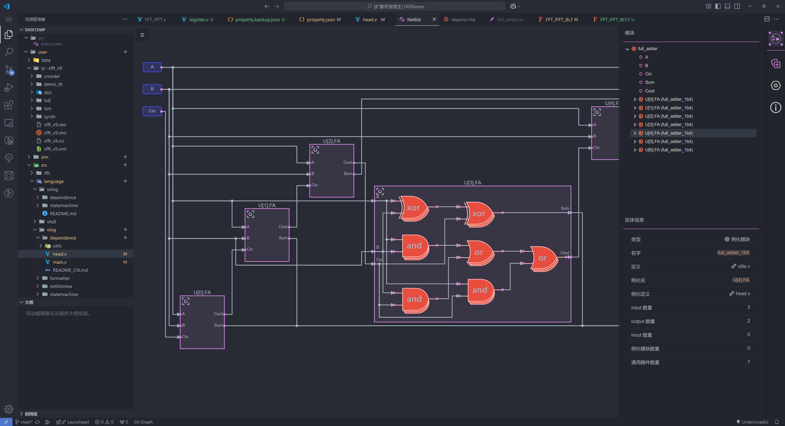

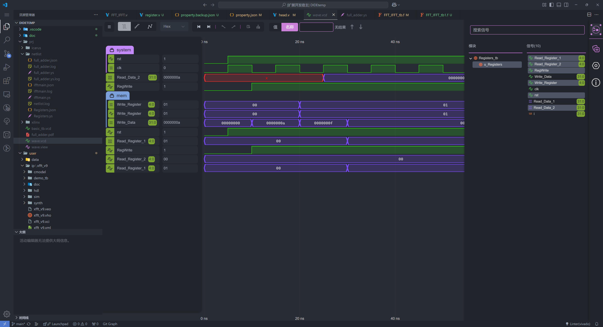

</Card>

<Card title="Light+ color display" icon="https://picx.zhimg.com/80/v2-d6eb33d06a512edcad625af79d5da7a4_1440w.png">

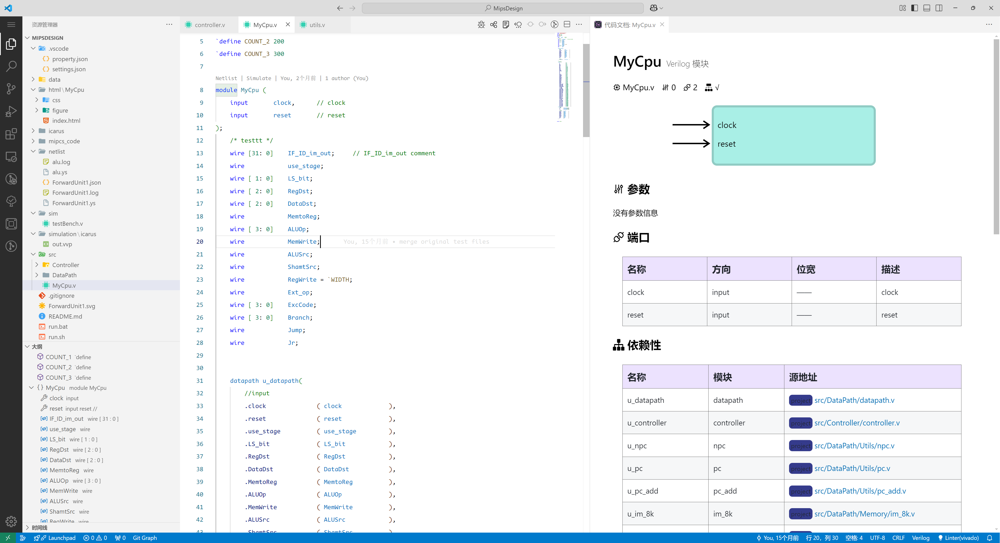

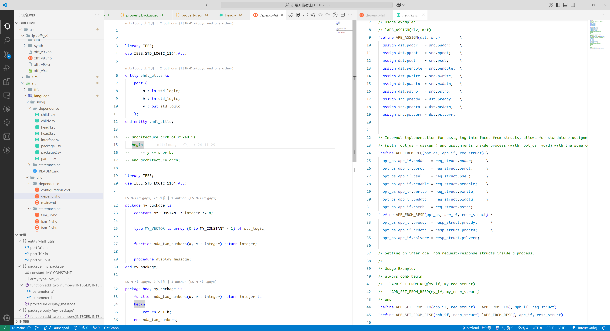

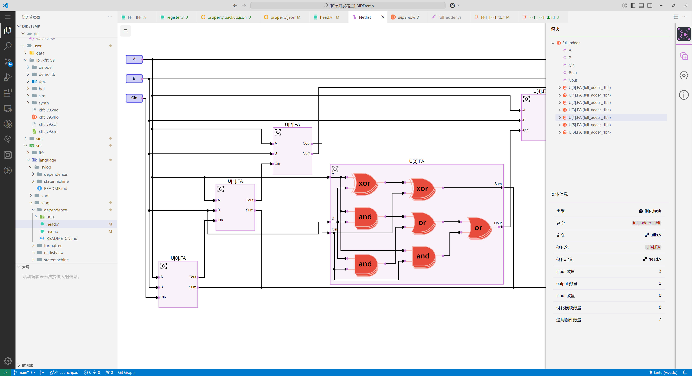

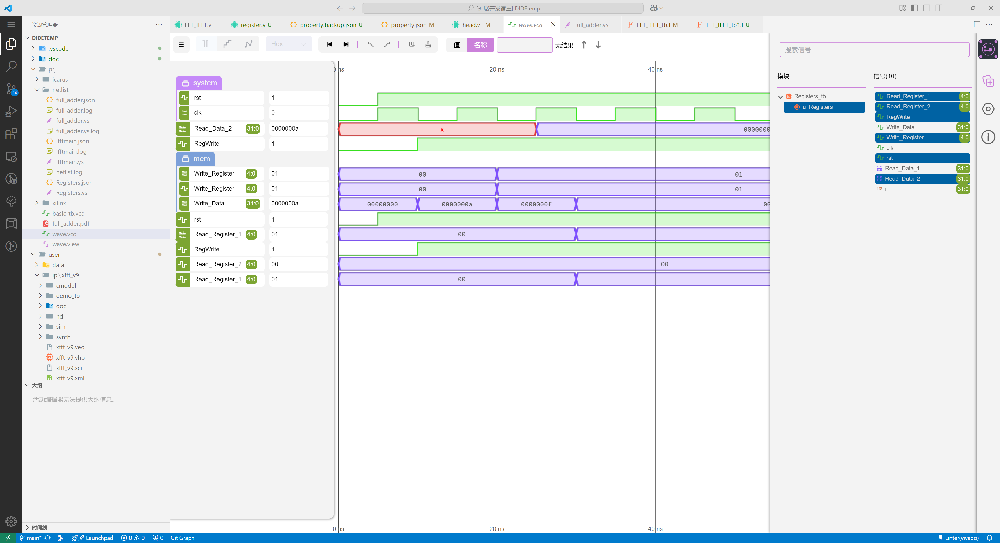

</Card>

<Card title="Atom One Light color display" icon="https://picx.zhimg.com/80/v2-d6eb33d06a512edcad625af79d5da7a4_1440w.png">

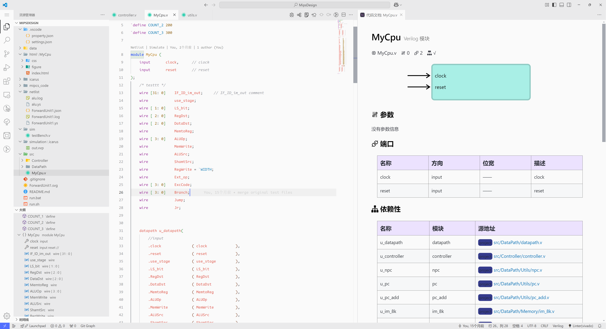

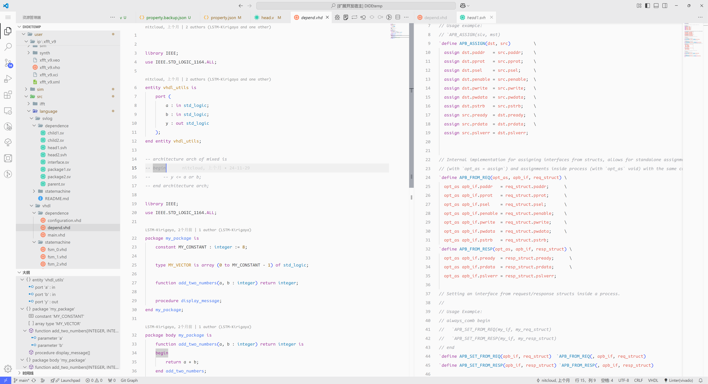

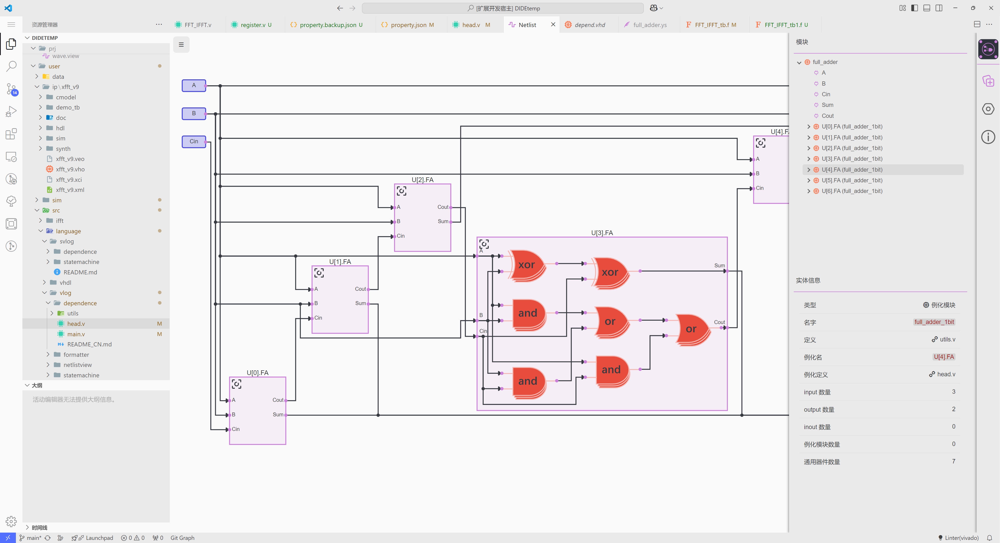

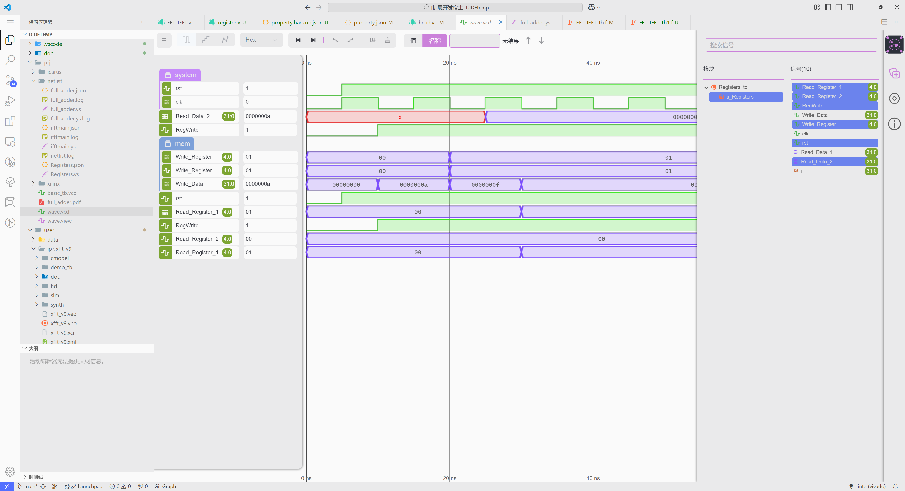

</Card>

:::info About our support for other color themes
Since the highlighting feature is highly customized, support for this feature will not be prioritized except for commercial orders. However, recommended highlighting themes will be provided to enhance the coding experience for users.
:::

Suggested theme configurations:

- Color Highlighting: [One Dark Pro](https://marketplace.visualstudio.com/items?itemName=zhuangtongfa.Material-theme&ssr=false#review-details) or [monokai pro](https://marketplace.visualstudio.com/items?itemName=monokai.theme-monokai-pro-vscode&ssr=false#review-details)
- Icon Theme:  [Material Icon Theme](https://marketplace.visualstudio.com/items?itemName=PKief.material-icon-theme&ssr=false#review-details)
