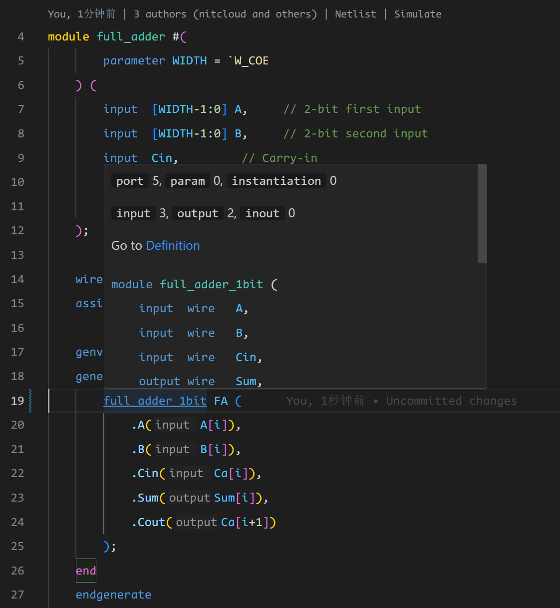

## Feature Description

<!-- Hover Tooltips consist of two main components:

1. Definition of the Symbol. The complete definition of the symbol, ending with one of the following terminators: ,, ;, or end.
2. Comments Associated with the Symbol. Includes both the comments following the definition and the comments preceding it (block comments & inline comments).
  - Trailing Comments: Comments on the same line as the symbol's definition.
  - Leading Comments: All comments above the symbol's first line, stopping at the nearest symbol encountered.
  - Comments support WaveDrom rendering.
3. Hover Tooltips for Instance Content
  - Tooltip behavior for different aspects of module instantiation is as follows: Module Name: Displays the module's definition details (see Figure 1).
  - Module Instance Name: Displays details of the module instantiation (see Figure 2).
  - Instantiation Port: Displays the definition of the corresponding port (see Figure 3).
  - Wires Connected to Instantiation Ports: Displays the definition of the wire connected to the port (see Figure 4). -->

The hover feature refers to the functionality where the IDE displays the context information of a variable next to the cursor when the cursor moves over the variable. Users can quickly understand the basic information of a variable through the hover feature. In the context of HDL development, a variable can be a signal, an instantiated module, a macro definition, or other symbols. DIDE provides a set of hover features to display the context of these variables.



## HF.1 HF.1 Rendering Comments

Hover tips also collect and render comments surrounding variables in the view. DIDE currently supports rendering line comments or block comments above the variable declaration and to the right of the same line. Here is an example:

```verilog
`define value 10  
/*
 * Block comment section
 */
// Inline comment section
module name #(
        // Leading comment
        parameter DATA_WIDTH // Trailing comment
    ) (
        // Leading comment
        input idata // Trailing comment
    );  
    
    wire wave;
    
    // Leading comment
    // Leading comment
    // Leading comment
    wire out, in
         sig; // Trailing comment
    
endmodule
```

@[artPlayer](/videos/lsp/hover.mp4)