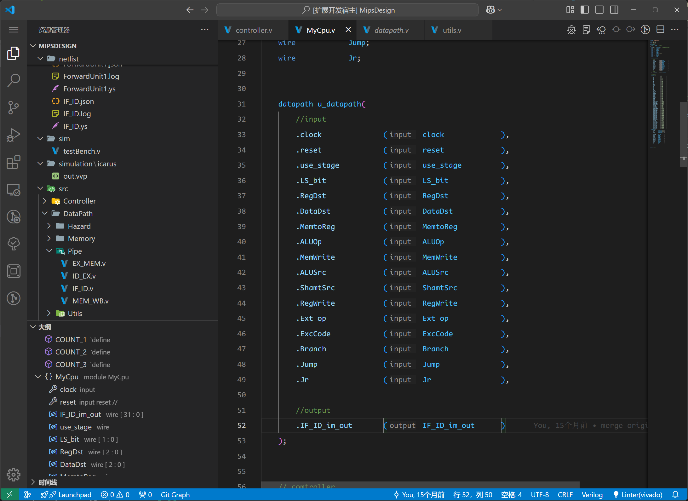
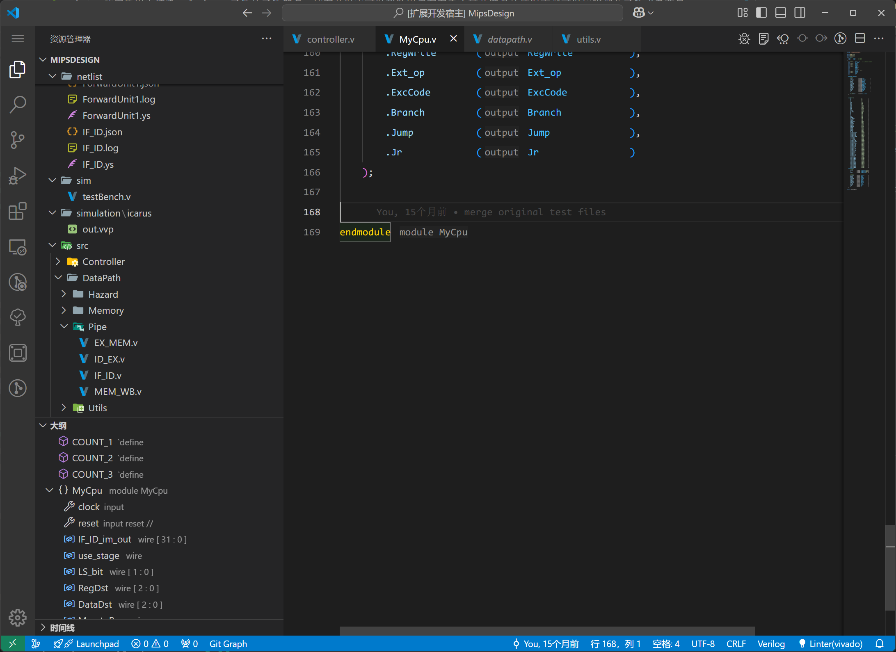

## Feature Description

Inlay Hints is a new IDE technology used to render inline text in the text editor to provide hints. In the popular Java development tool IDEA, Inlay Hints is widely used to render the function signature of a Java function. This helps users to know the context of a function or variable without taking their hands off the keyboard, thus improving the efficiency of development and code reading.

DIDE also introduces the Inlay Hints feature for the first time in HDL.

## Feature Support

### IF.1 Port Direction of Instantiated Modules

Render the direction (input or output) of the ports in instantiated modules.

### IF.2 模块申明的结尾

Render the name of the current module at the end of the module with `endmodule`.`

