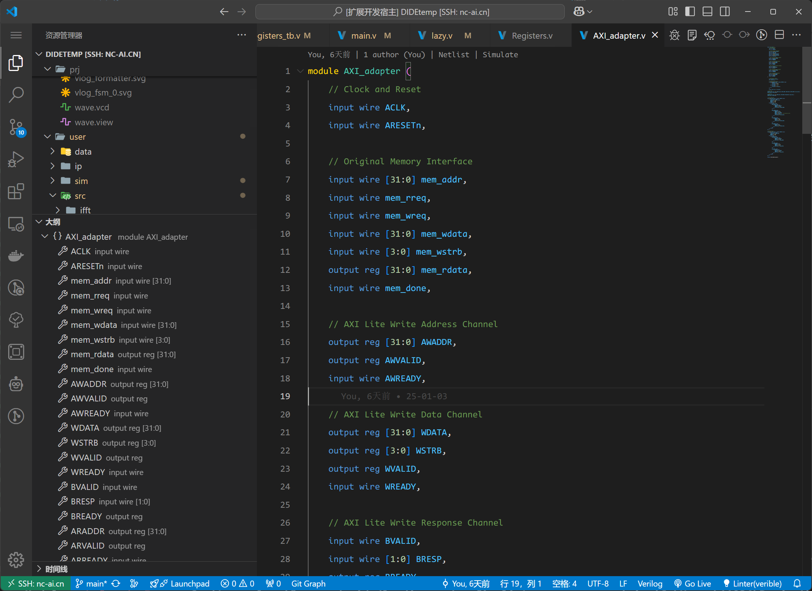

## Outline

On the left side of the workspace, the HDL code file outline is displayed, allowing users to quickly locate the modules or variables they need to review. This feature also provides the most direct feedback from the parser. If this feature fails, all related functions of the parser and language services will be disabled. In such cases, restarting may resolve the issue.

