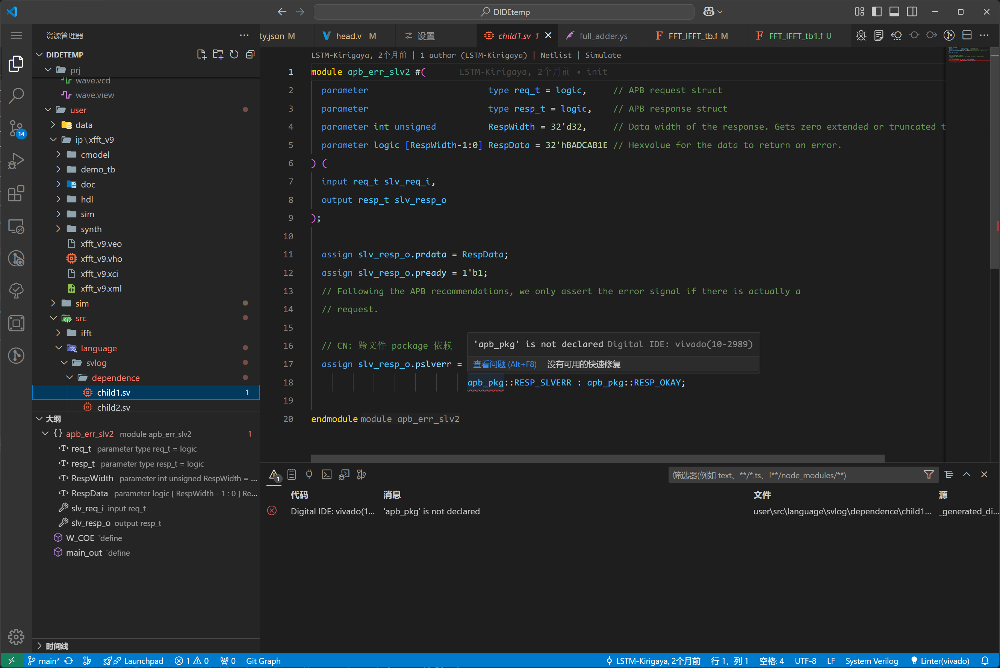
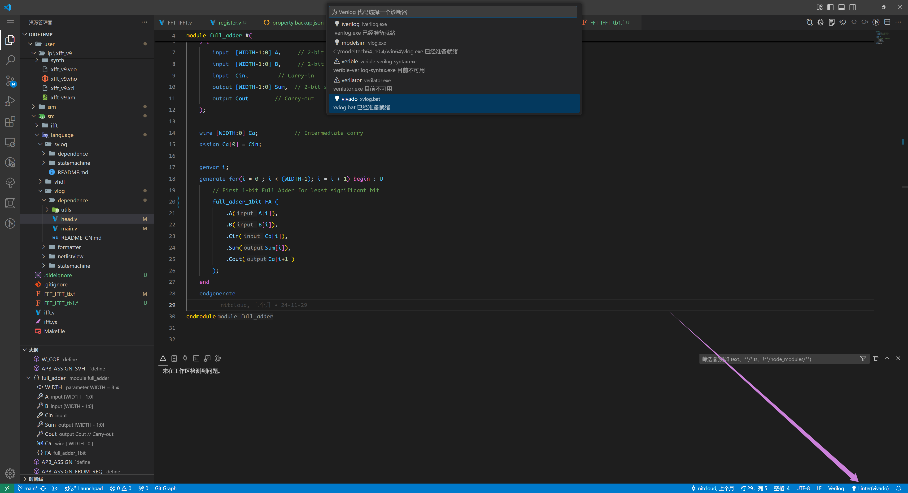
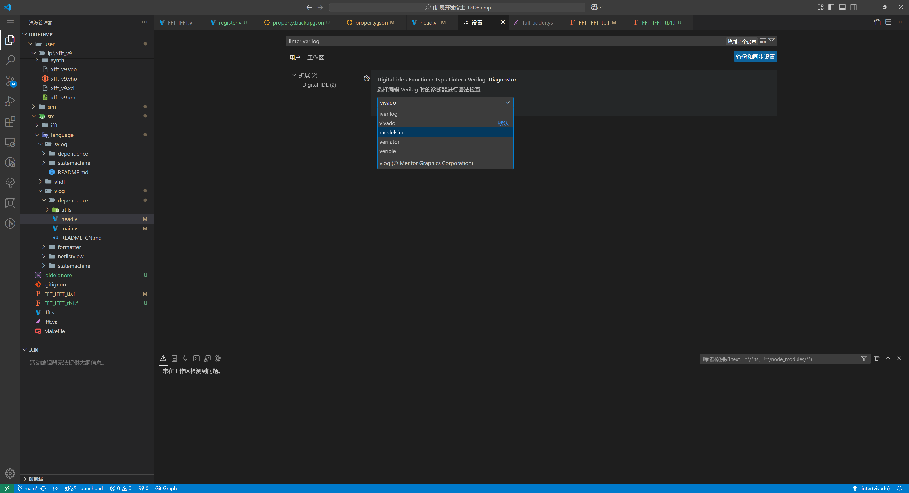
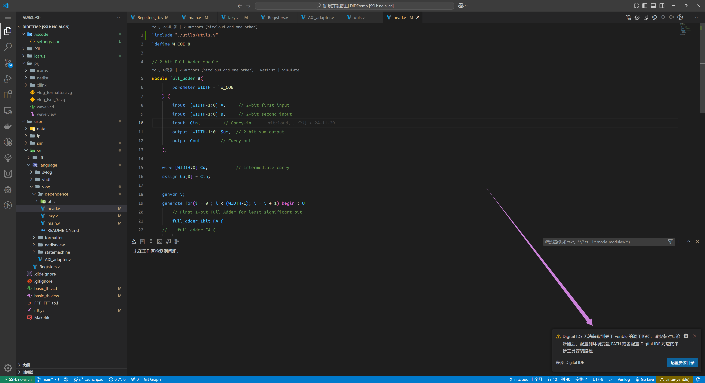
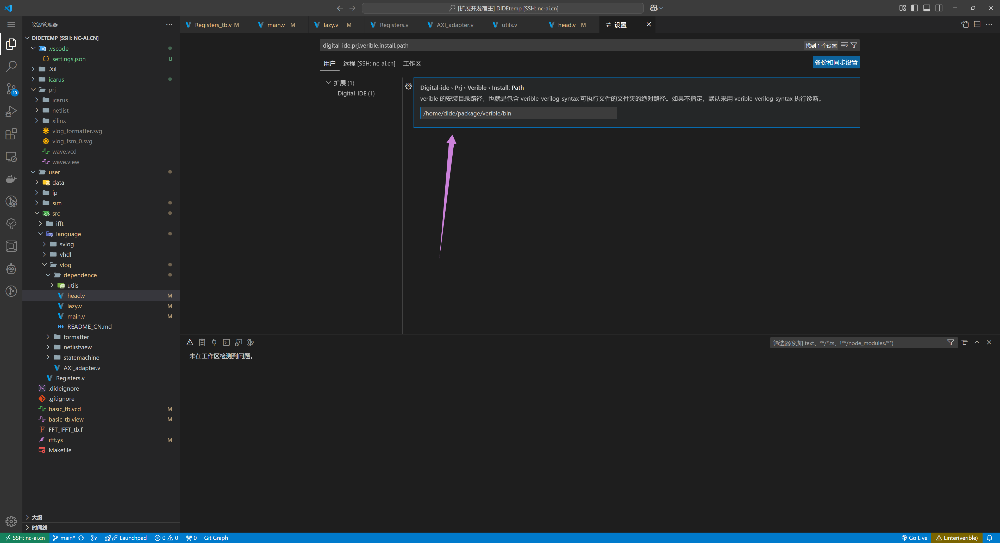
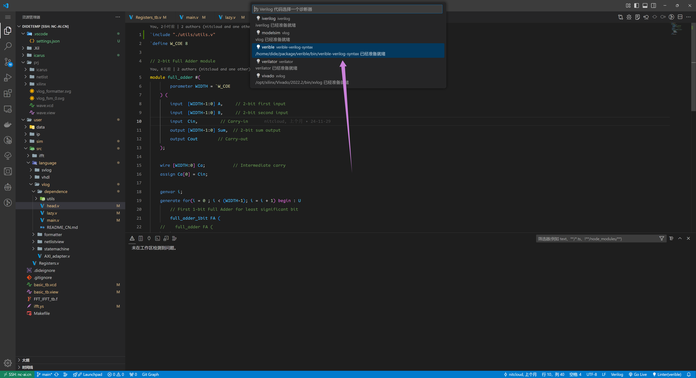
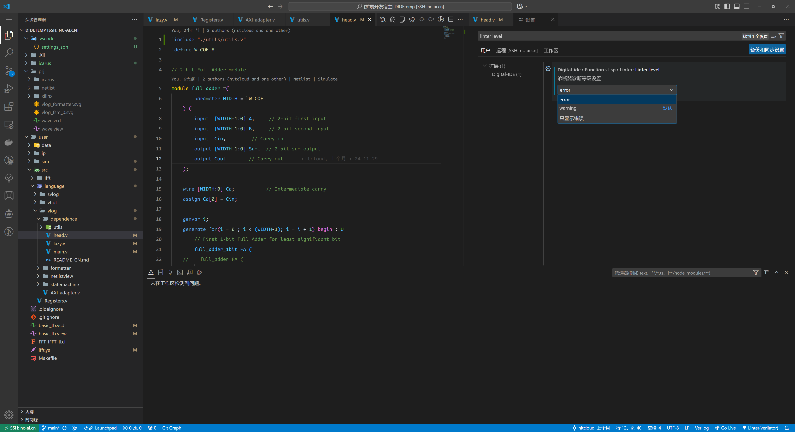
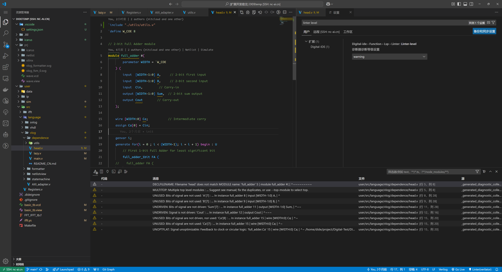
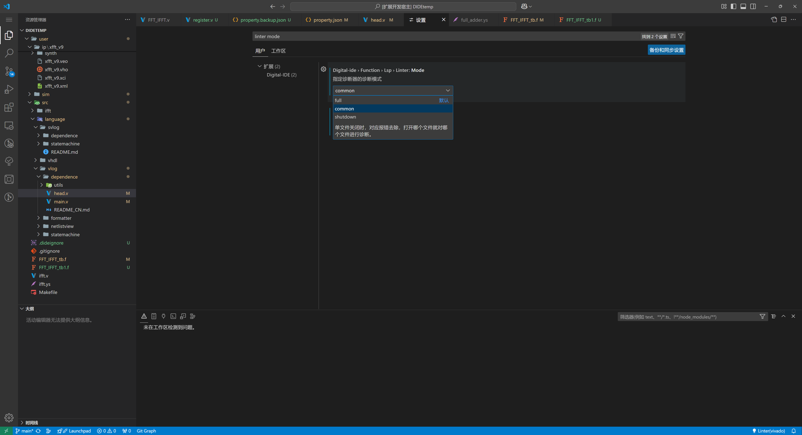

## Syntax Diagnosis

Syntax diagnostics can help developers identify hidden syntax errors in the code during development, allowing them to avoid potential issues before compilation or execution, thus improving development efficiency.

There are several diagnostic tools available in the HDL community, and DIDE strives to be compatible with these tools. Below is a table providing basic information and the support status for each HDL language.

| Tool   | Verilog | SystemVerilog | VHDL |
|------------|---------|---------------|------|
| iverilog   | ✔️      | ❌            | ❌   |
| modelsim   | ✔️      | ✔️            | ✔️   |
| vivado     | ✔️      | ✔️            | ✔️   |
| verible    | ✔️      | ✔️            | ❌   |
| verilator  | ✔️      | ✔️            | ❌   |

> DIDE's own high-speed Linter is steadily progressing and will be available soon.

@[artPlayer](/videos/lsp/linter-introduction.mp4)

## Switching Diagnostic Tools (Linters)

### Method 1: Click Status Bar Item

Click the status bar item in the lower-right corner of the image above. A selection box will appear at the top of the window. Choose the desired linter. Available linters will have a lightbulb icon and the description "[xxx is ready]"; unavailable linters will have a warning icon and the label "[xxx is currently unavailable]".

### Method 2: Configure in Settings

Search for {hdl language id} linter in the settings, find the corresponding tab, and click to select. If an unavailable linter is selected, the status bar item for the linter in the lower-right corner will turn yellow, warning the user that the current setting is incorrect.

:::info
The options in Method 1 and Method 2 are linked. Modifying one will also cause changes in rendering and internal values of the other.
:::

## Linter Configuration

For certain third-party diagnostic tools, in order for DIDE to locate their core files for invocation, you need to either: add the diagnostic tool's executable file to the environment variables or configure the diagnostic tool's installation path.

###  Linter Online Configuration
If an offline linter is selected, as shown in the image, when the user selects `verible` (which is currently unavailable), a popup will appear asking the user:

Clicking on the configuration installation directory will redirect to the settings page, where the absolute path of the installation directory should be entered:

In the output below, the backend has correctly recognized the valid workload. As shown, the workload is the absolute path of a valid executable file. At this point, `verible` is online.

:::info
For some linters, the pop-up window above not only provides a button to jump to the 【Configure Installation Directory】 but also a button on the left labeled [Download {Linter ID}]. Clicking this will automatically complete the download and path configuration. However, it's important to note that this button is only available for certain linters on specific platforms. We are not responsible for the download source.
:::

### Modifying Diagnostic Level
Some linters, such as Verilator, may report warnings that can be annoying. In such cases, you can open the settings and find the following options:

- error: Only display errors
- warning: Display errors and warnings

<Card title="error mode: only errors are displayed" icon="https://picx.zhimg.com/80/v2-d6eb33d06a512edcad625af79d5da7a4_1440w.png">

</Card>

<Card title="warning mode: only errors are displayed" icon="https://picx.zhimg.com/80/v2-d6eb33d06a512edcad625af79d5da7a4_1440w.png">

</Card>

### Modify Diagnostic Mode

To modify the diagnostic mode, search for `linter mode` in the `Settings`, as shown in the image below:

Select the appropriate diagnostic mode:

- Full: Diagnose all design sources directly and report errors, regardless of whether the file is open.
- Common: When a single file is closed, corresponding errors are removed. Only the file that is open will be diagnosed.
- Shutdown: Disable global diagnostics, meaning no project-level errors will be reported (focus on coding).