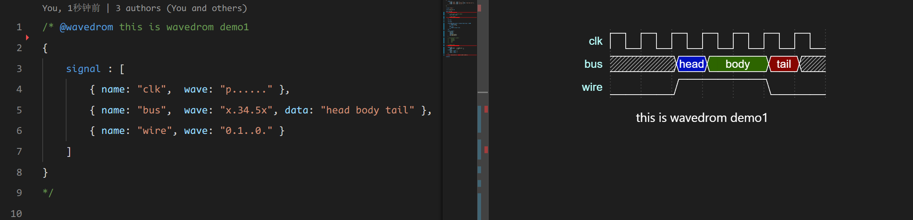

## CDF.1 - 5 Code to Doc

DIDE supports directly viewing the documentation for files like vlog and vhdl in your project. Simply click the button in the top-right corner to view the documentation. Through this feature, you can quickly understand the basic information and dependency information of the current Verilog or VHDL modules. Dependency information is also supported for navigation.

@[artPlayer](/videos/code2doc.mp4)

## CDF.6 Wavedrom Comment

Wavedrom is a tool used for drawing digital timing diagrams, particularly suited for hardware design and digital circuit simulation. It uses a simple JSON format to describe waveforms, which can be rendered in real-time in a browser. Wavedrom supports various waveform elements such as clocks, signals, and buses, making it widely used for documentation and teaching demonstrations.

DIDE also supports writing Wavedrom-style comments in comments, and rendering them in the documentation. Wavedrom comments must be written as block comments, and the first line of the block comment must include `@wavedrom`. DIDE will provide syntax highlighting for Wavedrom comments to help users write signals for demonstration purposes. Here's an example:


```json
/* @wavedrom this is wavedrom demo1
{
    signal : [
        { name: "clk",  wave: "p......" },
        { name: "bus",  wave: "x.34.5x", data: "head body tail" },
        { name: "wire", wave: "0.1..0." }
    ]
}
*/
```

Rendering effect:



For more usage of Wavedrom, please refer to their tutorials:

<detail-url
    href="https://wavedrom.com/tutorial.html"
    logo="https://wavedrom.com/images/logo.svg"
    title="wavedrom.com"
    desc="Hitchhiker's Guide to the WaveDrom"
></detail-url>

## CDF.7 Export your document

DIDE's documentation supports the following three export formats:

- markdown
- html
- pdf

@[artPlayer](/videos/exportpdf.mp4)

The exported documentation is by default located in the `./doc` directory of the project.

To export to PDF, please fill in the executable path of Google Chrome or Edge browser on your machine in the parameter **markdown-pdf executable path**. Since most PDF readers do not support colored backgrounds, please export your PDF under a light color theme.

:::info
For Windows 11 users, there's no need to set the browser path by default. This is because the path to the built-in Edge browser, `C:/Program Files (x86)/Microsoft/Edge/Application/msedge.exe`, is fixed.
:::