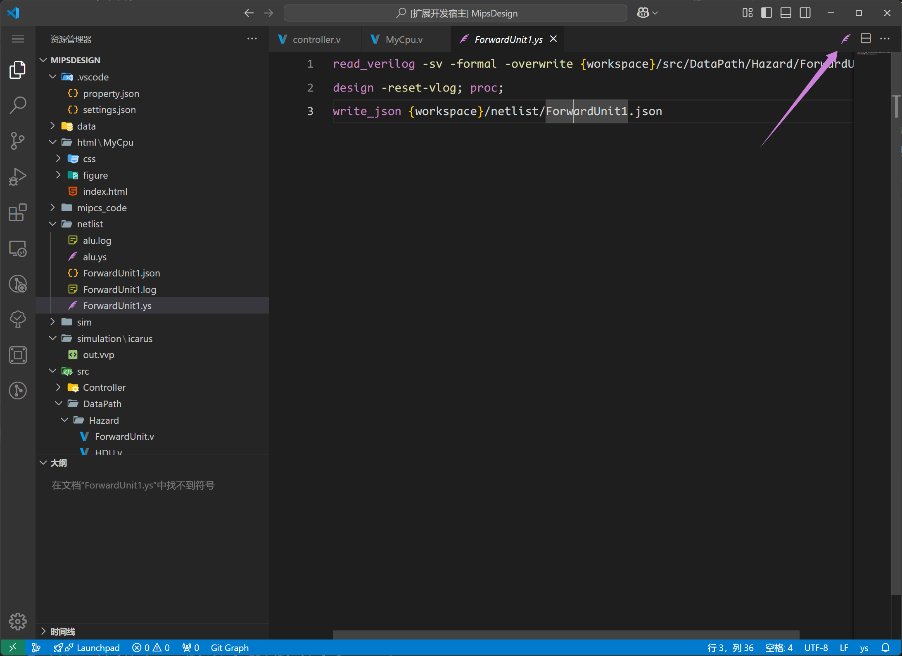

## Netlist Preview

We have integrated the Yosys executable file (directly compiled) into the plugin backend. This integration allows project code synthesis (limited to Verilog and certain SystemVerilog files; see the Yosys official website for supported features) without the need to install or configure any additional software. After synthesis, the generated netlist can be visualized as a schematic diagram.

There are two ways to trigger a Netlist.

### NF.1 Method 1：Codelens

By using the `codelens` Netlist above the module, the netlist of the current module can be rendered.

As shown in the image below, the `Netlist` button functionality is accessed by hovering over the module name.

@[artPlayer](/videos/netlist/trigger-codelens.mp4)

### NF.2 Method 2：Module tree

In the module tree, you can also view the netlist of a certain module.

@[artPlayer](/videos/netlist/trigger-treeview.mp4)

## NF.4 - 7 Netlist Basic Usage

:::warning
The netlist in version 0.4.0 is still a work in progress with limited functionality. More features will be added in future updates.
:::

@[artPlayer](/videos/netlist/usage.mp4)

## NF.3 Manually Execute YS Script

We also provide support for YS scripts. You can write your own YS script and execute it directly using DIDE. Click the pink feather icon in the top-right corner to execute the current YS script.

