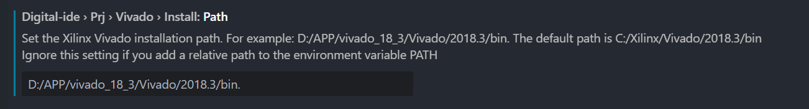
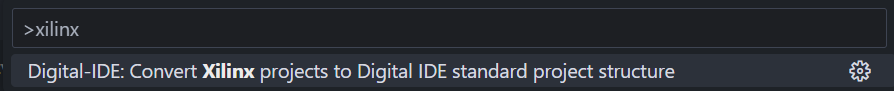
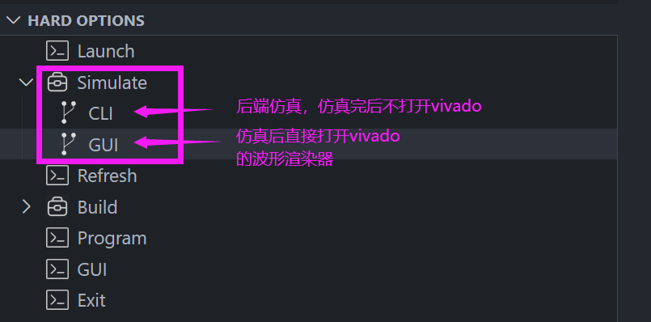
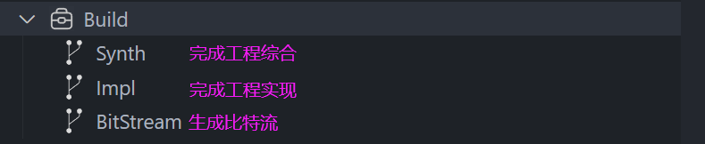
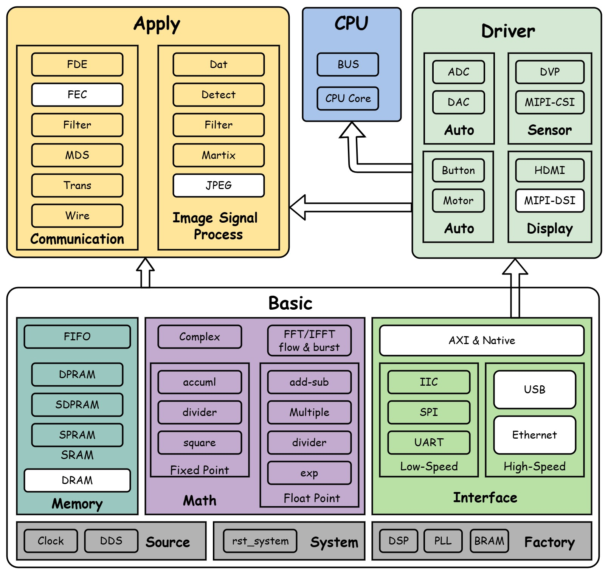
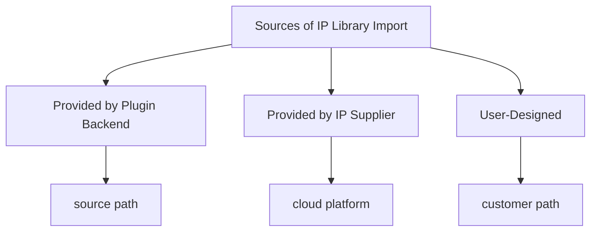
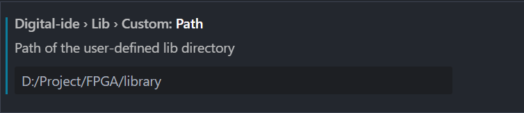

Project management primarily focuses on accomplishing the following tasks:

1. Project Setup
   - Library Manager (IP & BD)
   - Project Manager (PS & PL)
2. Simulation Setup
   - Instances & AI for Generate tb file
   - Fast simulate & Generate simulation script
3. Design Assistance
   - Tree Structure
   - Code-Document
   - Netlist-View
   - Wave-View

## DIDE Project Configuration

### Standard File Structure


The core configuration of a DIDE project lies in the `property.json` file. A standard project structure for a project named `PROJECT_NAME` is as follows:

::: file-tree
- PROJECT_NAME
  - .vscode
    - property.json  Project configuration file (can also be placed in the workspace root directory, customizable by the user)
  - prj:  Directory for project files
    - simulation/  Contains intermediate files generated by third-party simulation tools during runtime
    - factory/  Contains original factory project files (e.g., from Xilinx, Efinix)
  - user  Directory for user-designed source files, customizable
    - ip/  Contains project IP code (managed by vendor tools but moved to the src directory by the plugin)
    - bd/  Contains project block design source files (managed by vendor tools but moved to the src directory by the plugin)
    - data/  Primarily stores data and constraint files
    - sim/  Contains user simulation code
    - src/  Contains user design source code
    - lib/  Stores user hardware library source code
    - sdk/  Contains software design files corresponding to Xilinx SDK design
:::

:::info
The separation of hardware and software design has been removed, and they are now merged. In SoC development mode, an sdk folder will be added under user, simplifying the overall project management design. If the plugin does not detect a `property.json` file in the corresponding workspace, it will consider the structure as having no configuration file. The project management system will then apply the following definition (all detections will search directly under the workspace, which may cause the plugin to lag—use with caution):
:::

```json
"arch" : {
    "structure" : "null", // Our inhouse configuration, or if the user sets this field outside the specified range, it defaults to this setting.
    "prjPath": "${workspace}/prj",
    "hardware" : {
        "src"  : "${workspace}", 
        "sim"  : "${workspace}",  
        "data" : "${workspace}" 
    },
    "software" : {
        "src"  : "${workspace}",
        "data" : "${workspace}" 
    }
},
```

### Custom File Structure

The user-defined file structure is configured using the `arch` property (detailed configuration instructions are provided in the next subsection), and in this case, the `structure` type must be set to `custom`.

:::info
When structure is configured to anything other than `custom`, all other properties are ignored, and only the specified mode is used. If an undefined mode outside the three predefined ones is used, it will result in an error and be treated as a user mode. If no definition is provided in user mode, the entire workspace will be parsed.
:::

### Ignored File Design

To enhance project customization, the management system introduces an ignore design. The filename `.dideignore` contains entries similar to `.gitignore`, consisting of file or folder paths (relative or absolute) with optional regex. HDL files listed in .dideignore are excluded from parsing, rendering, and monitoring. An example of the syntax is as follows:

```bash
# Ignore all files under the user/src folder, equivalent to user/src/* and user/src/
user/src

# Ignore all files with the .v extension under the user/src folder
user/src/*.v
```
:::info
The priority of the ignore file is higher than defined file paths. If the path to src is included in the `.dideignore` file, the entire src directory will not be added to the project for parsing, rendering, monitoring, or other operations.
:::

### Configuration File Definition

```json
// Explanation of all attributes in porperty.json
{
    // The third-party toolchain currently in use
    "toolChain": "xilinx", 
    "toolVersion" : "2023.2.307",

    // Project naming
    // PL: Programming Logic Design, previously FPGA
    // PS: Processing System Design, previously SOC
    "prjName": {
        "PL": "template",
        "PS": "template"
    },

    // Custom project structure. If this attribute is not present, it is considered a standard file structure (see details below)
    "arch" : {
        "structure" : "", // standard | xilinx | custom
        "prjPath" : "",   // Path for storing intermediate files during project runtime
        "hardware" : {    
            "src"  : "",  // Path for design source files; note: IP & bd are placed above src
            "sim"  : "",  // Path for simulation files, which will be reflected in the tree structure
            "data" : ""   // Path for constraint and data files, constraints will be automatically added to the vivado project
        },
        "software" : {
            "src"  : "",  // Path for software design files
            "data" : ""   // Path for software-related data files
        }
    },

    // Library management, supports both remote and local calling methods (see details on library management below)
    // It is recommended to use the UI for configuration, not to change it manually
    "library" : {
        "state": "", // local | remote
        "hardware" : {
            "common": [], // Common libraries provided by the plugin
            "custom": []  // User's custom design libraries
        }
    },

    // Xilinx's IP repository, directly added to Vivado's IP repo
    // Currently supports ADI and ARM-provided IP repositories (adi | arm)
    "IP_REPO" : [],

    // When both PL and PS are used, it is an SOC development
    // When the core is not "none," it is considered a mixed development
    "soc": {
        "core": "none",
        "bd": "",
        "os": "",
        "app": ""
    },
    
    "device": "none"
}
```

The configuration for the project path should support the following features:

1. All attributes should support the placeholders `${workspace}`, `${plname}`, and `${psname}`:
   - `${workspace}`: The path of the current workspace.
   - `${plname}, `${psname}`: The names of the PL or PS projects.
2. Support relative path syntax, such as: `./user/src`.
3. Support regular expressions for path matching.

:::info
The configuration file format must remain compatible with future versions. Additionally, remove the design of changing the file structure by modifying the configuration file.
:::

## Standard Functional Entry

In order to better accommodate third-party EDA synthesis tools, the following general design interfaces are defined:

1. Launch: Start the entire project. If there is no project, create one; if there is, open it directly.
2. Refresh: Refresh the entire project and update the design.
3. Simulate: Simulate the entire project. By default, do not open the GUI *`(uses the simulator in the TOOL_CHAIN)`*
   1. SimGUI: Open the GUI interface after a successful simulation.
   2. SimCLI: Do not open the GUI interface after a successful simulation.
4. Build: Build the entire project and output the bitstream file.
   1. Synth: Perform project synthesis.
   2. Impl: Perform project implementation.
   3. Bitstream: Output the project’s bitstream file.
5. Program: Download the bitstream file (download and program, but do not fuse)
6. GUI: Open the toolchain’s GUI interface.
7. Exit: Close the project.
  - When clicking Exit, the plugin will move your IP and bd designs to the user/src/ directory.

Two important functions outside the action frame:
1. setSrcTop
  - Refresh the tree structure.
  - Reconfigure the toolchain.
2. setSimTop
   - Refresh the tree structure.
   - Reconfigure the toolchain.
3. Do simulation for current module.
4. exportFilelist
   - Export *.f files including the current module and all dependent file absolute paths.

### Xilinx Compatibility Notes

This plugin essentially reimplements the Vivado UI, enabling users to complete the entire project workflow—including creation, synthesis, implementation, bitstream generation, and download—without needing to open Vivado's GUI, and without relying on Xilinx's IP and block design (BD).

#### Environment Configuration
First, you need to install Vivado and configure its installation path as shown in the diagram below:



This configuration method allows users to easily switch between different versions of Vivado for execution.

#### Building Your Project

When you need to create a new project, simply follow these three steps:

1. Create a new project folder and open it with VSCode.
2. Open the command line, create the configuration file, and set your device ID.
3. Drag the corresponding code into the appropriate folders.

At this point, your project is set up. Refer to the video below for specific steps:

@[artPlayer](/videos/pm/create-new-prj.mp4)

When you already have a standard Xilinx project, you can use the following command to convert it with a single action. (It is recommended to back up your project before conversion.)



The characteristics of a standard Xilinx project are as follows:
1. Design code is located under {prjName}.srcs/sources_1/new.
2. Constraint code is located under {prjName}.srcs/constrs_1/new.
3. Simulation code is located under {prjName}.srcs/sim_1/new.
4. IP components are located under {prjName}.srcs/sources_1/ip.
5. BD components are located under {prjName}.srcs/sources_1/bd.

:::info
After completing the conversion, you need to restart Vscode to avoid unnecessary parsing.
:::

#### Use Vivado's simulator for simulation.



#### Synthesis, implementation, and exporting the bitstream.

Based on the aforementioned `standard feature entry`, users can complete the entire project's synthesis, implementation, and bitstream export. The "launch" function primarily handles the project setup; it will directly open the project if it already exists, or create a new project if none is found.

:::info
The project path defined in `property.json` under the `arch.prjPath` attribute should be checked for an .xpr file:
   - If one is found, open it directly. If there are multiple, prompt the user to select one. If the GUI is enabled, directly open the Vivado interface.
   - If none is found, a project will be built based on the content configured in `property.json`.
:::



## Dependency Structure Rendering

The structural tree rendering mainly shows the hierarchical structure of the project’s connection dependencies, where modules are the basic unit and illustrate the hierarchical relationships between modules. However, module attributes are more complex and include more than one type. They can be categorized as follows:

1. File Classification: Display the design file partitions, which are currently divided into the design and simulation areas. Each area only includes modules under the corresponding folder.
2. Design Top Level: Show which module is the top-level design for the current project. Initially, this is random, but it will be defined by the user later.
3. Simulation Top Level: Show which module is the top-level simulation for the current project. Initially, this is random, but it will be defined by the user later.
4. Linked Modules: Show which modules are located in non-local files, generally library code defined by the plugin.
5. Primitive Modules: Show which modules are factory primitive modules.
6. IP Code Blocks: Show the top-level modules of IP, such as those from Xilinx and other factory IP modules.

Explanation:
Specially, for primitive modules and IP code modules, no jump is required when clicked. For icon explanations:
- For primitive modules, such as IBUFDS (and others as mentioned above), the celllib icon should be used.
- For IP code modules, check the ip folder for a matching folder. If a matching folder is found, use the corresponding icon.

Update Trigger Events:
1. When files or folders are added, removed, or renamed in the workspace within VSCode, the structure tree update event is triggered.
2. When files or folders are added, removed, or renamed in the workspace within the file manager, the structure tree update event is triggered.
3. When the property.json file is modified, the structure tree update event is triggered, mainly to update changes in the file structure and library files.
4. When the content of an HDL file in the workspace is updated in VSCode, the related information for that file will be updated.

## Library Management System

:::warning
The library management system is still under development, and future demand changes are expected.
:::

The library management system helps users quickly import IP libraries provided by the plugin, third parties, or the user's own designs into the entire project design. This system assists users in quickly setting up a usable project template, allowing them to focus more on business-level design. The design for the library management system is defined as follows:

### Library Import Methods:
1. GUI Guided Import (Recommended)
2. Property File Configuration



### Types of Imported IP Libraries

1. Local [Local Import]
2. Remote [Remote Link] (Recommended)

:::info
The reason for having two types of design is that a remote design can lightweight the engineering design sources for faster distribution. However, when using the remote option, if modifications are made to the IP library code, the changes will be permanent, which is not recommended. 
:::

Therefore, local import is supported here. The local import type directly copies the IP library code to the local machine, allowing the user to modify it without affecting other projects that use the IP library.

### Sources of IP Library Import



The import interface is shown as follows:

@[artPlayer](/videos/pm/import-library.mp4)

### User Library Settings

Users can set the paths for the libraries they commonly use:



The method to import user libraries:

