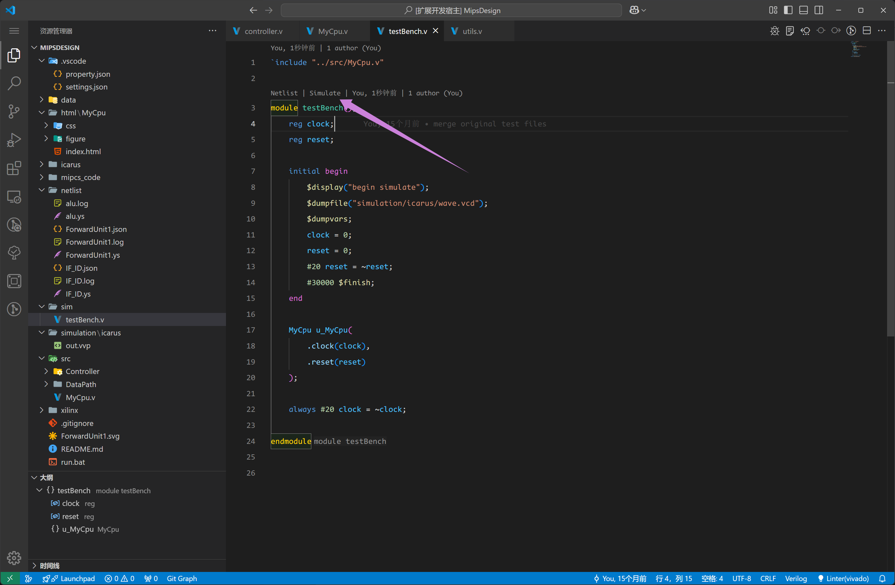
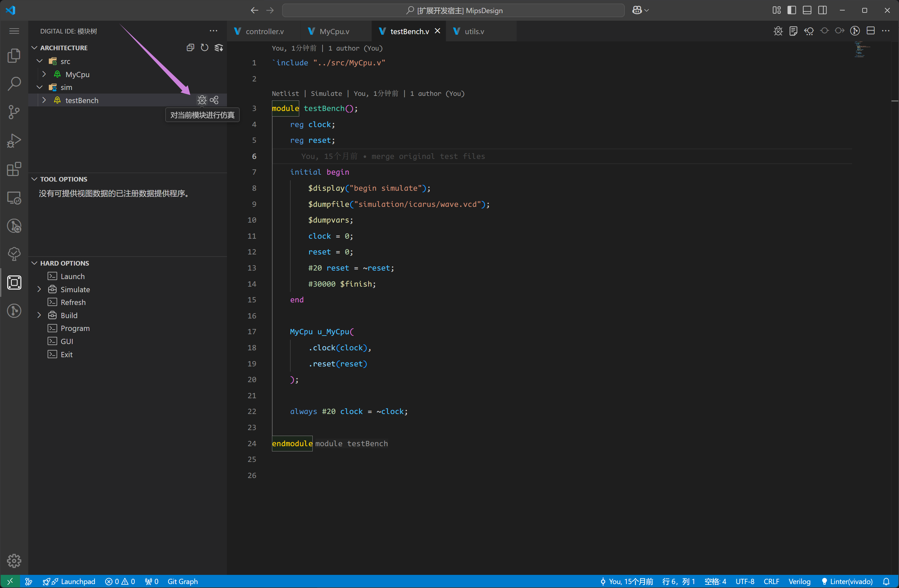
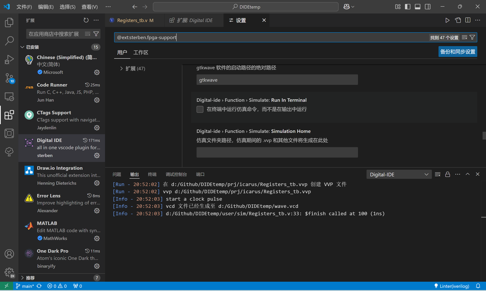

The purpose of simulation building is to help users to build their own simulation framework quickly and get simulation results quickly.

## iverilog

For quick verification of small modules, we have provided a one-click fast simulation feature, which relies on `iverilog` for execution. Therefore, users need to configure the installation of `iverilog` themselves.

For the latest version 0.4.0, we have made special adjustments for include statements. Whether you include them or not, the simulation can proceed normally, but we strongly recommend not writing include statements. The design of include can introduce higher complexity and result in instability during execution.

During the initial setup, install `iverilog` and configure it in the system environment, or specify its installation path in the settings.

## Quick Simulation

There are two ways to trigger quick simulation. One is through the inline characters in `codelens`, and the other is through the button in the module tree.

### SF.1 Quick Simulation via codelens

As shown in the image below, the Simulate button located on top of the module name serves as the entry point for quick simulation.



### SF.2 Quick Simulation via Module Tree

As shown in the image below, the entry point for quick simulation is located in the dependency structure.



After clicking for quick simulation, if a VCD file is generated, DIDE will automatically open the corresponding waveform renderer.

@[artPlayer](/videos/vcd/trigger-simulate.mp4)

### FAQ

<Card title="No VCD file is generated." icon="https://picx.zhimg.com/80/v2-d6eb33d06a512edcad625af79d5da7a4_1440w.png">

If no errors occurred during execution, the issue might be that the testbench (TB) file is missing statements to generate the VCD waveform file:

```verilog
initial begin
    $dumpfile("prj/icarus/FFT_IFFT.vcd");        
    $dumpvars(0, FFT_IFFT_tb);
    #2000 $finish();
end
```
</Card>

<br>

<Card title="Where is the nererated VCD file?" icon="https://picx.zhimg.com/80/v2-d6eb33d06a512edcad625af79d5da7a4_1440w.png">

When you use `dumpfile` to specify an export path in your project, the root of this path is your working directory. For example, with the following file structure:

::: file-tree

- PROJECT_NAME
  - .vscode
    - property.json
  - user
    - sim/
      - test.v
    - src/
:::

test.v:

```verilog
module test();
    initial begin
        $dumpfile("prj/test.vcd");        
        #2000 $finish();
    end
endmodule
```

The VCD file will be generated in the root directory under `prj/test.vcd`, according to the file structure you mentioned:

::: file-tree

- PROJECT_NAME
  - .vscode
    - property.json
  - prj
    - test.vcd
  - user
    - sim/
      - test.v
    - src/
:::

</Card>

<Card title="Execution freezes with no output." icon="https://picx.zhimg.com/80/v2-d6eb33d06a512edcad625af79d5da7a4_1440w.png">

A: If no errors occurred during execution, the issue might be that the testbench lacks a `$finish();` statement. It is strongly discouraged to omit this statement as it causes the VCD file to grow indefinitely and leads to the iverilog backend freezing the process. Add a `$finish();` statement to complete the validation design properly.

</Card>

<Card title="Cannot simulate and no error message" icon="https://picx.zhimg.com/80/v2-d6eb33d06a512edcad625af79d5da7a4_1440w.png">

When the quick simulation feature encounters an error:
1. Remove the include section from the code.
2. Downgrade the iverilog version to 11, or download the Windows version directly from the group files as shown in the image. This issue will be fixed in the future; the above is a temporary workaround.
3. As shown in the image below, do not select run in terminal in the DIDE settings.

</Card>
