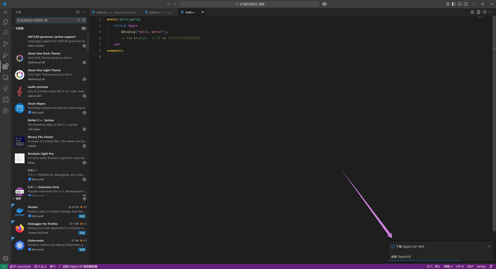
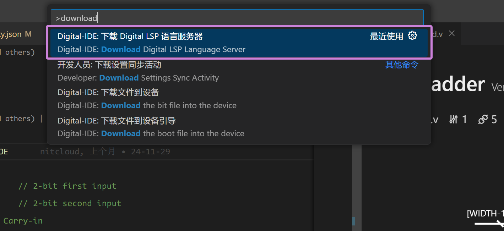
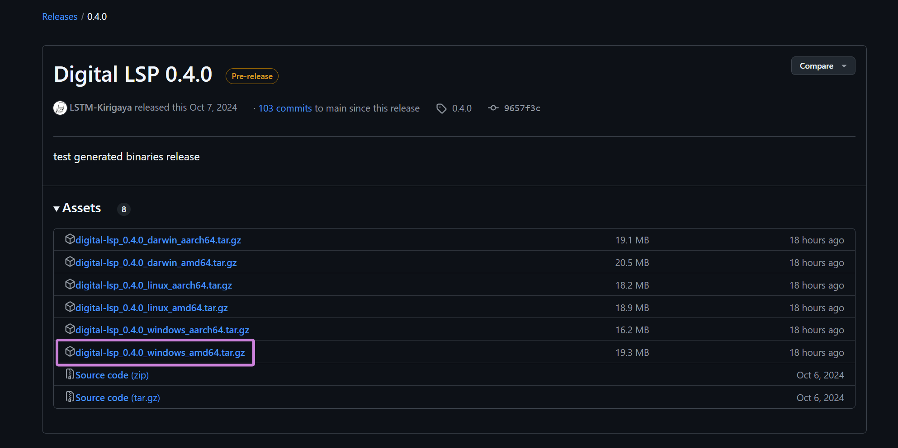
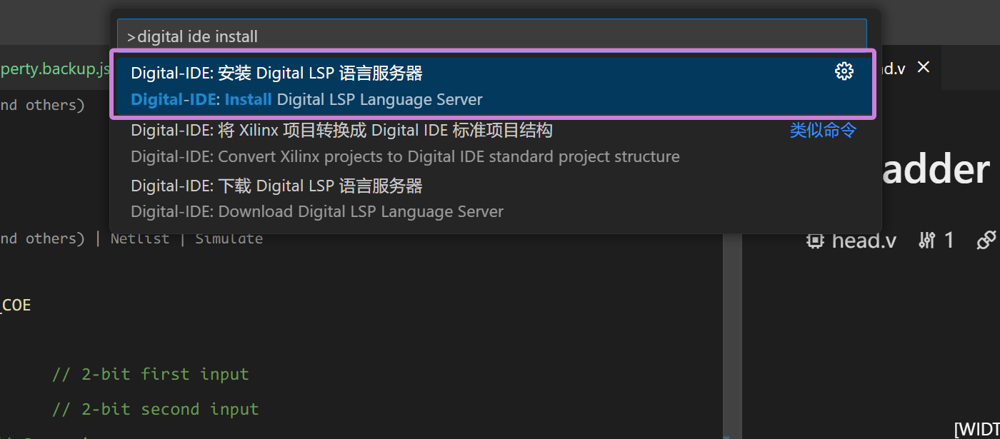
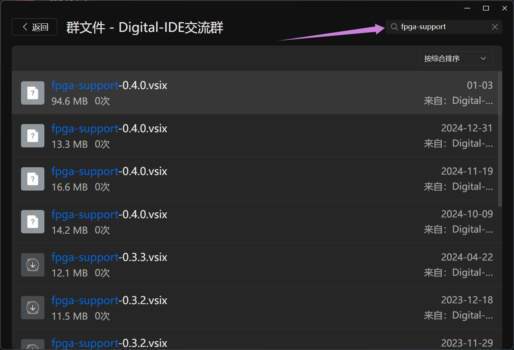
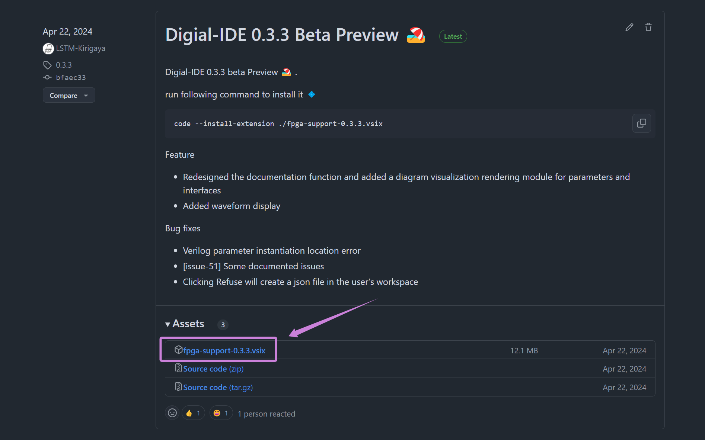

## Install from Vscode

Search for “Digital IDE” in the Vscode plugin store and click download.

> Note: This plugin is ready to use immediately after download, with no additional setup required. However, if third-party tools (e.g., Vivado, Icarus Verilog, etc.) are needed, you will need to install the respective software independently.

@[artPlayer](/videos/quick-start/install-from-vscode.mp4)

### Online Installation of LSP (Automatic)

After the download is complete, if there are any HDL files (ending with `.v`, `.sv`, or `.vhd`) in your current directory, DIDE will start automatically. If it's the first time the current version of DIDE is being launched on the target machine, it will automatically download `digital-lsp` during startup, as shown in the image below:

This is the core load that DIDE uses to parse HDL files and provide language services. Without it, most of DIDE's functionalities will be offline. We provide both domestic and international download sources, and theoretically, most regions should be able to download digital-lsp in a stable and smooth manner.

### Online Installation of LSP (Manual)

The main version of the digital LSP may not always be synchronized with DIDE. If you'd like to experience the latest version of digital LSP for the same version (e.g., 0.4.0), you can download it manually. Open VSCode, press F1, type download, and find the command shown in the image below:

This will download the latest digital LSP and deploy it into DIDE.

### Offline Installation of LSP (Manual)
If your environment is behind a corporate network or otherwise cannot access the internet, you will need to download the LSP offline. First, download the corresponding version of the LSP from the repository based on your target machine's operating system and architecture. We provide two repository sources, and we ensure that both repositories are synchronized:

- Github: https://github.com/Digital-EDA/Digital-IDE/releases/tag/\{版本\}
- Gitee: https://gitee.com/Digital-IDE/Digital-IDE/releases/tag/\{版本\}

For example, if your target machine is an x86 Windows (common for domestic workstations), you should choose the compressed file that contains `windows` and `amd64` for download:

After copying to the target machine, press `F1`, type `install`, and then select the following command from the list:

In the opened file browser, locate the previously downloaded and copied compressed package to install it. After installation, restart vscode to complete the process.

:::info
If you encounter any issues, feel free to join our QQ group (932987873) to consult with us.
:::

## Install beta version

Thanks to the efforts of our team, DIDE is constantly being updated. The version available in the Vscode marketplace may differ significantly from the latest version. If you want to use the latest test version of our plugin, you can obtain the latest vsix file through the following methods:

:::info Method 1: Download from the QQ Group Files 
Join our QQ discussion group (932987873), and in the group files, search for `fpga-support`. Click "More" and select the latest version (the one at the top) to download.

:::

:::info Method 2: Download from Release
Download `fpga-support-{version}.vsix` from [releases](https://github.com/Digital-EDA/Digital-IDE/releases).

We recommend joining our group chat, as it offers the following benefits:

1. Experience new versions earlier. Beta versions are released for internal testing 3–4 months before the official release.
2. Quickly resolve any issues you encounter.
3. Receive prompt responses to your feature requests.
:::

Once you download the vsix, you can install from vsix:

@[artPlayer](/videos/quick-start/install-from-vsix.mp4)

