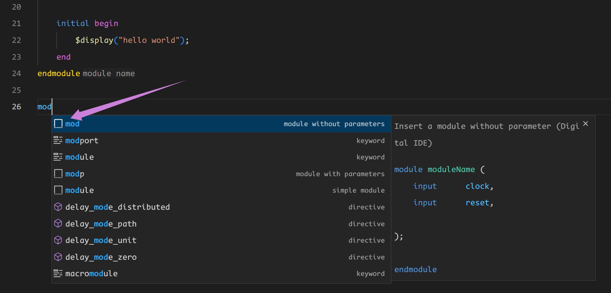

## 功能说明

代码设计中的自动补全功能 (completion) 指 IDE 根据用户的输入自动预测并给出补全建议， DIDE 提供的自动补全分为如下几类：

- 代码片段自动补全
- 关键词自动补全（关键词，系统函数，宏）
- 自动例化
- 原语例化

## 代码片段补全

snippet 补全（代码片段补全）是 vscode 自带的一种补全方式，由插件和用户所提供的 snippet 共同组成。用户定义常用代码的模板，vscode 会自定根据前缀把这个模板补全添加到自动补全列表中。不同于一般的自动补全结果，snippet 的补全项的前缀图标是一个空心方块，比如下图中的 `mod`, `modp` 和 `module` 都是 snippet 补全项。

### 预定代码片段

DIDE 提供了 verilog 和 vhdl 的常用模板，在本插件的 snippet 中补充了一些常用设计组件，如申明模块、边沿提取、计数器、简单状态机模板等逻辑：

@[artPlayer](/videos/lsp/completion-snippet.mp4)

### CF.1 自定义代码片段

如果你希望自行补充自定义的一些snippet功能，可以进行如下操作：

@[artPlayer](/videos/lsp/completion-user-define-snippet.mp4)

## CF.2 自动例化

你是否还在手动进行模块的例化？是否还在一个一个查看要例化的参数和端口？担心例化是缺少端口连接？针对这些问题本插件提供了自动例化功能，能帮助你快速例化你要连接的模块。只要打出你想要例化的模块名（可自动关联）就能将该模块的例化自动补充出来。使用过程如下：

@[artPlayer](/videos/lsp/completion-common-instance.mp4)

如果你不知道有哪些模块；或者想不出模块的具体名字；或者在有多个重名模块时，需要指定要例化的模块时你就需要使用快速例化来自动补全。使用流程如下：
1. 将光标放置在文本需要例化处。

2. 使用快捷键`F1`启动命令框，输入*instance*，选择`Digital-IDE: Generate instance template from selected module`命令。
   - 或者使用快捷键`Alt + I`。
   - 或者在需要例化处右击选择`Generate instance template from selected module`
3. 输入需要例化的模块的关键字（插件会自动匹配）。
4. 选择需要例化的模块，并回车。

:::info
在使用快捷键时，需检查是否存在快捷键键冲突。
:::

## CF.3 原语例化
同时，在 `0.4.0` 版本之后，插件包含了`xilinx`以及`efinix`的所有原语的例化，同时给出相应的注释，再也不用到vivado中的language template里面进行复制。

@[artPlayer](/videos/lsp/completion-primitive.mp4)

有关自动例化的几个可以设置的参数的说明：

| 配置项                                      | 描述                                                                 | 默认值  |
|---------------------------------------------|----------------------------------------------------------------------|---------|
| `function.lsp.completion.vlog.autoAddInclude` | 是否在例化模块时自动在文件开头加入 `include`                          | `true`  |
| `function.lsp.completion.vlog.completeWholeInstante` | 是否完整地自动补全整个例化所需要的所有 `parameters` 和 `ports` | `true`  |
| `function.instantiation.addComment`          | 是否在例化后加入一些注释                                             | `true`  |
| `function.instantiation.autoNetOutputDeclaration` | 是否在例化后自动完成所有 `output` 端口的定义                     | `true`  |

## CF.4 关键字补全

DIDE 支持 IEEE 2005 标准下的所有关键字、系统函数、宏等等的自动补全和部分函数的文档说明。

@[artPlayer](/videos/lsp/completion-keyword.mp4)

## CF.5 特殊字符补全触发

除了常规的字符（正常的大小写字母）敲入会引发上述的各类自动补全外，一些特殊字符也会触发自动补全：
1. `.` 关键符触发例化模块的 `端口` 以及 `参数` 的补全

2. <code>\`</code> 关键符触发 `宏定义` 标识的补全
3. <code>/</code> 关键符触发 <code>\`include</code> 中 `路径` 的补全

> 目前自动补全只支持在verilog和systemverilog中例化模块里进行端口参数例化时的补全。不使用 <code>\`</code> 只输入字符，DIDE 也能对宏进行补全（还会自动加上 <code>\`</code> 前缀）

@[artPlayer](/videos/lsp/completion-special-trigger.mp4)
    
## 后续规划

- [ ] **宏定义**：支持宏定义函数补全
- [ ] **sv 高级语法支持**：支持sv语言的class、interface等中的 `.` 补全

