## 支持的语言

DIDE 现支持以下语言的高亮

| 分类 | 子项          | 说明                          |
|------|---------------|-------------------------------|
| HDL  | verilog       | Verilog 硬件描述语言          |
|      | systemverilog | SystemVerilog 硬件描述语言    |
|      | VHDL          | VHDL 硬件描述语言             |
| TCL  | xdc           | Xilinx 设计约束文件           |
|      | sdc           | Synopsys 设计约束文件         |
|      | fdc           | FPGA 设计约束文件（包括 xdc、sdc、fdc 约束文件） |
|其他  | ys            | yosys 综合脚本文件 |

## 关于主题配色

Vscode 中，语法高亮的具体颜色由【颜色主题】定义， Vscode 默认的主题为 `Dark+`，我们演示中还会使用 `One Dark Pro` 配色。这两款颜色和它们对应的亮色主题（`Light+` 和 `Atom One Light`）也是我们目前主力支持的配色。`One Dark Pro` 配色清新，适合对于美观程度有追求的人，而默认的 `Dark+` 则中规中矩且具有一定对比度，很适合需要长时间高强度开发代码的技术人员。

除了基本的代码高亮， DIDE 的其他功能，比如文档化、vcd 查看器、netlist 的 UI 也全面支持用户的 Vscode 主题颜色。萝卜青菜各有所爱，来尝试自己最喜欢的配色吧！

## 配色展示

<Card title="Dark+ 配色演示" icon="https://picx.zhimg.com/80/v2-d6eb33d06a512edcad625af79d5da7a4_1440w.png">

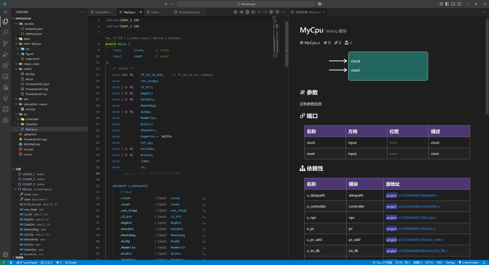

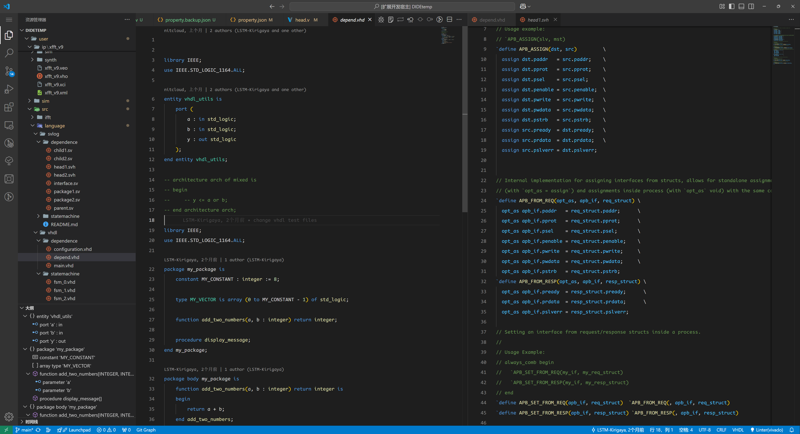

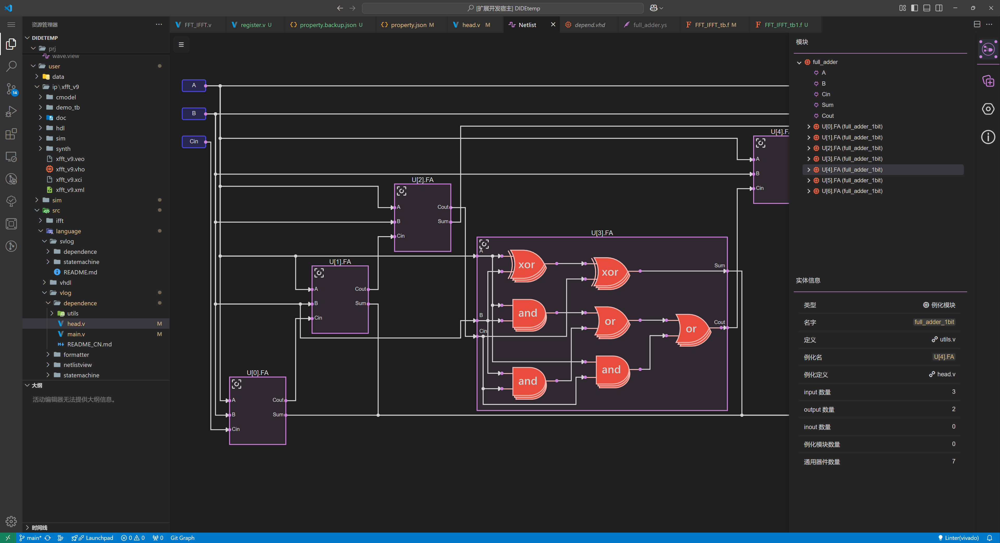

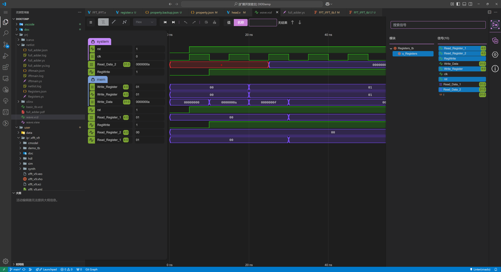

</Card>

<Card title="One Dark Pro 配色演示" icon="https://picx.zhimg.com/80/v2-d6eb33d06a512edcad625af79d5da7a4_1440w.png">

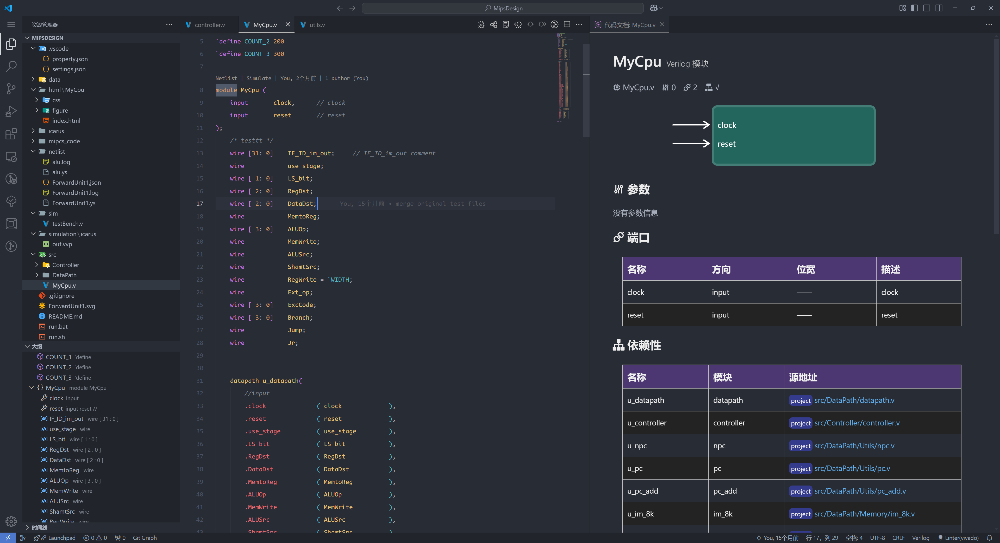

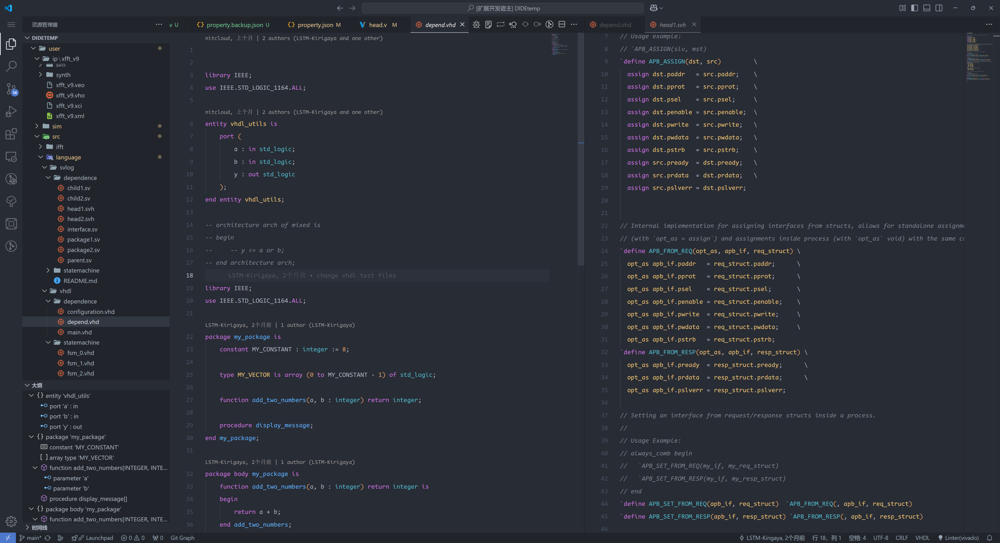

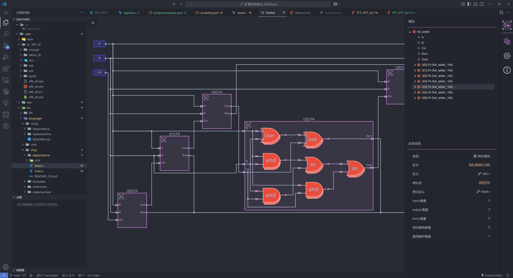

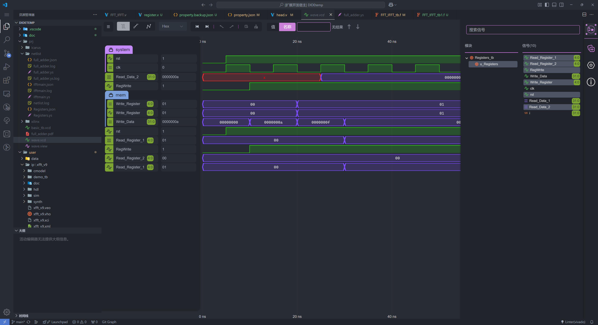

</Card>

<Card title="Light+ 配色演示" icon="https://picx.zhimg.com/80/v2-d6eb33d06a512edcad625af79d5da7a4_1440w.png">

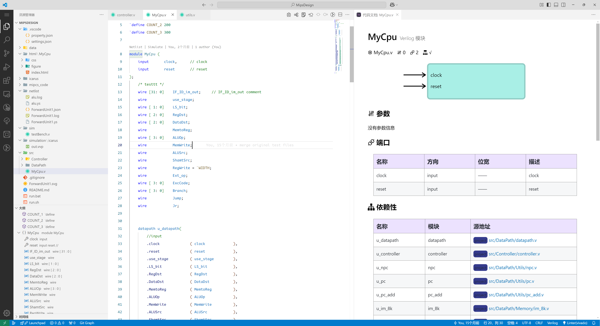

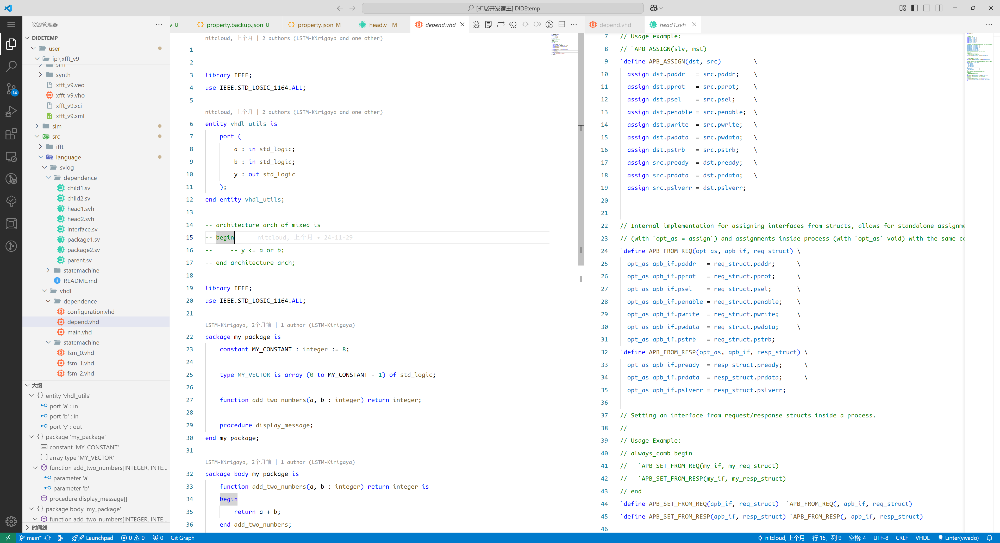

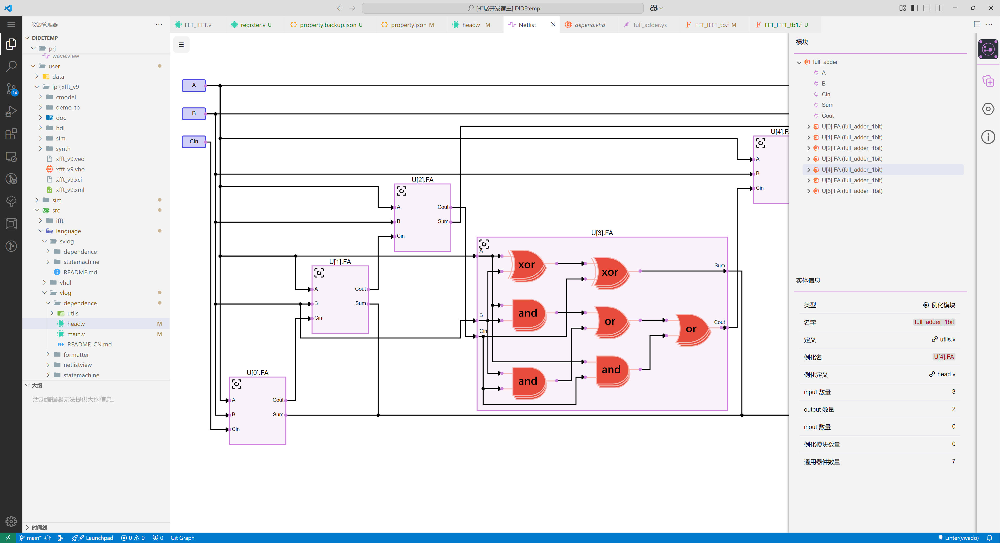

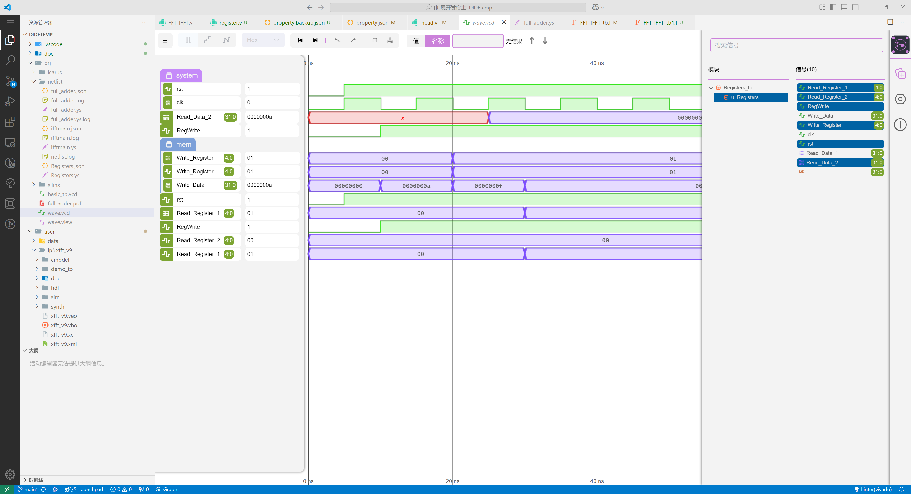

</Card>

<Card title="Atom One Light 配色演示" icon="https://picx.zhimg.com/80/v2-d6eb33d06a512edcad625af79d5da7a4_1440w.png">

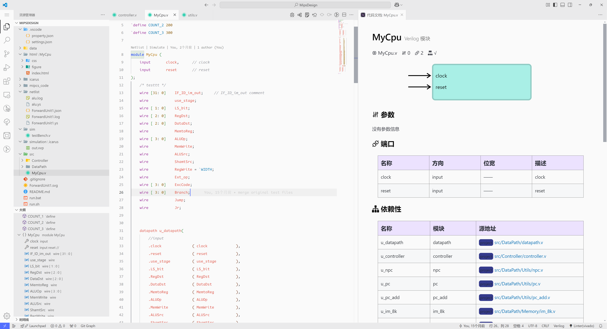

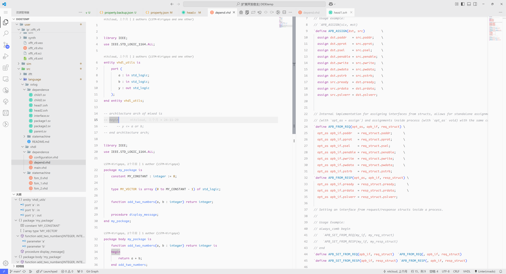

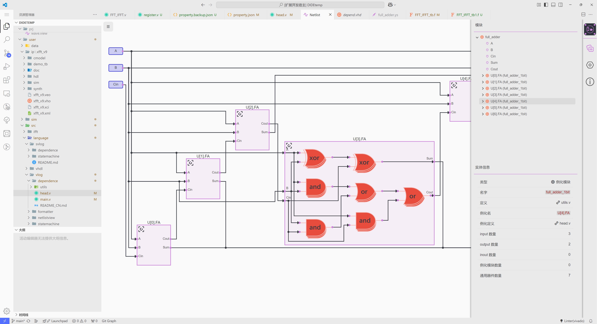

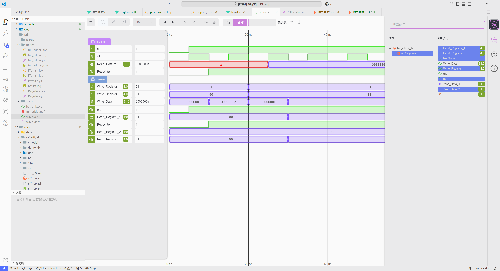

</Card>

:::info 关于我们对其他配色的支持
由于高亮功能是一个极强的定制化内容，对于此部分的需求，除商业订单外都将不会优先给予支持。但是会给出建议的高亮主题给用户带来更好的code体验。
:::

参考主题配置: 

- 颜色高亮: [One Dark Pro](https://marketplace.visualstudio.com/items?itemName=zhuangtongfa.Material-theme&ssr=false#review-details) 或者 [monokai pro](https://marketplace.visualstudio.com/items?itemName=monokai.theme-monokai-pro-vscode&ssr=false#review-details)
- icon主题: [Material Icon Theme](https://marketplace.visualstudio.com/items?itemName=PKief.material-icon-theme&ssr=false#review-details)

