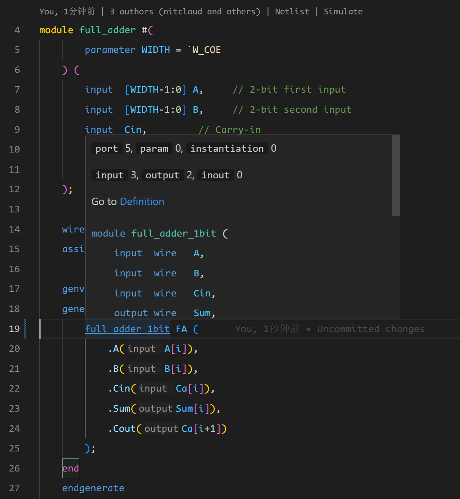

## 功能说明

悬停提示 (Hover) 功能指的是当你的光标移动到一个变量上时，IDE 会负责将这个变量的上下文信息显示在光标的旁边。用户通过 hover 功能可以快速了解到一个【变量】的基本信息。在 HDL 开发的语境下， 【变量】可以是信号，例化模块，宏定义或者其他的符号。 DIDE 提供了一套悬停提示的功能，用于展示这些变量的上下文。




## HF.1 渲染注释

悬停提示还会将变量周围的注释收集并渲染到视图中。 DIDE 目前支持渲染在变量申明处上方和同一行右方的行注释或者块级注释。下面是一个例子：

```verilog
`define value 10
/*
*  块注释处
*/
// 行注释处
module name #( 
        // 定义上注释
        parameter DATA_WIDTH = 3 // 定义后注释
    ) (
        // 定义上注释
        input idata // 定义后注释
    );  
    
    wire wave;
    
    // 定义上注释
    // 定义上注释
    // 定义上注释
    wire out, in, sig; // 定义后注释
    
endmodule
```

@[artPlayer](/videos/lsp/hover.mp4)

