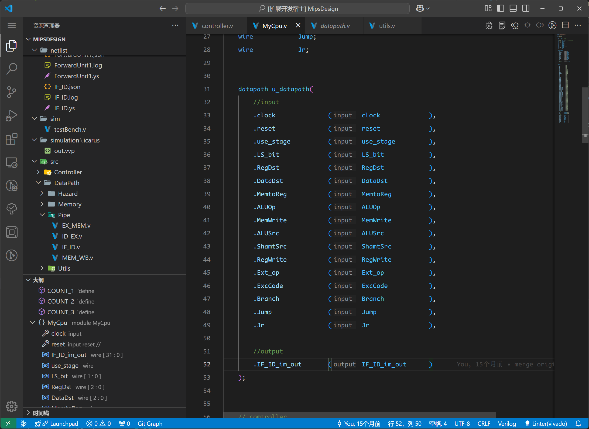
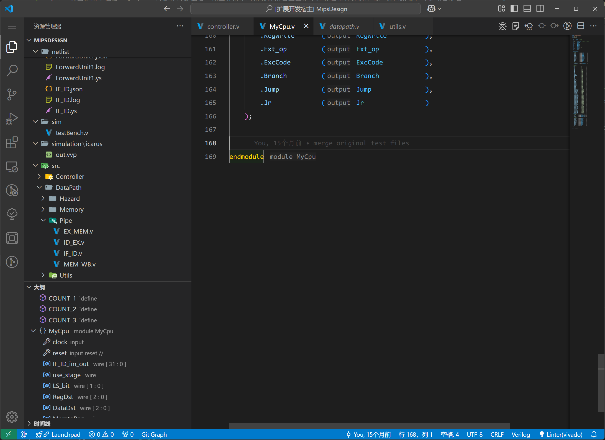

## 功能介绍

Inlay Hints 是一项新的 IDE 技术，用于在文本编辑器中渲染行间文本，用于进行提示。在知名 java 开发工具 IDEA 中， Inlay Hints 被广泛用于渲染一个 java 函数的函数签名，这在开发中可以帮助用户在双手不离开键盘的情况下就可以知晓部分函数或者变量的上下文信息，增加开发和阅读代码的效率。

DIDE 中也首次在 HDL 中引入了 Inlay Hints 的功能。

## 特性支持

### IF.1 例化模块的端口方向

在例化模块的端口中渲染方向（input 还是 output）

### IF.2 模块申明的结尾

在模块的 `endmodule` 结尾渲染当前 module 的名字。

