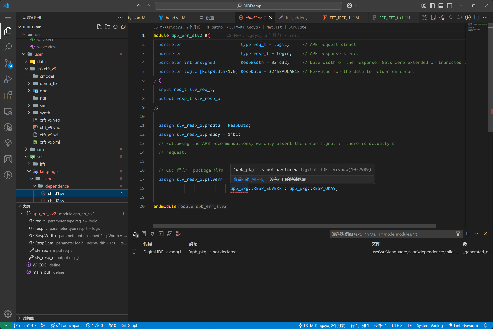
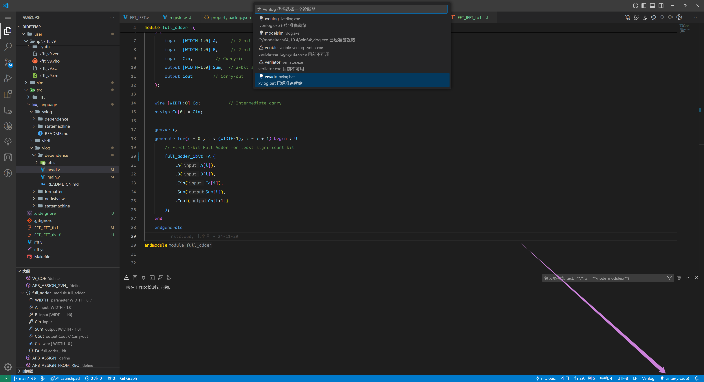
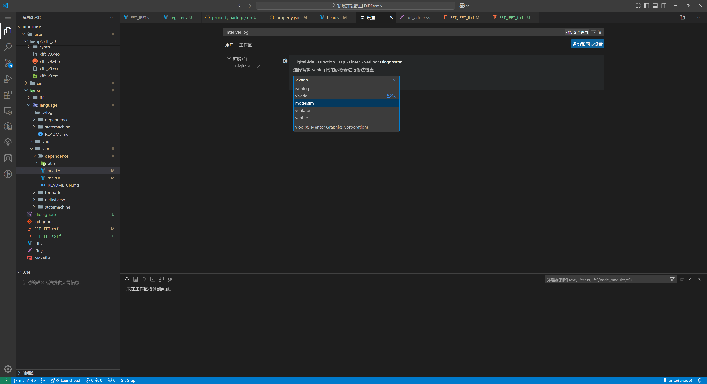
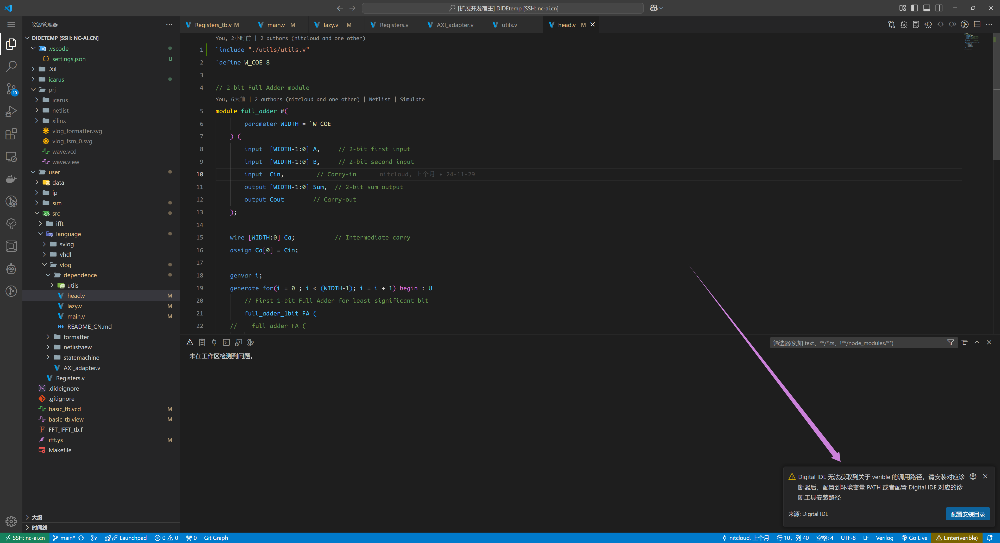
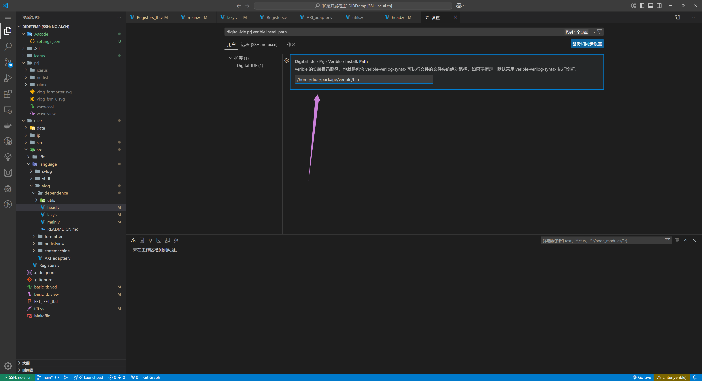
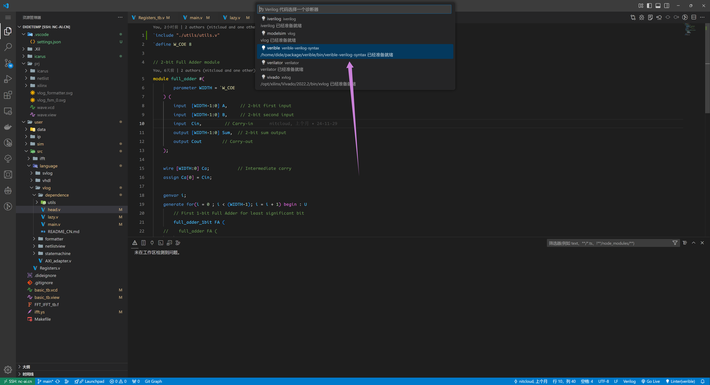
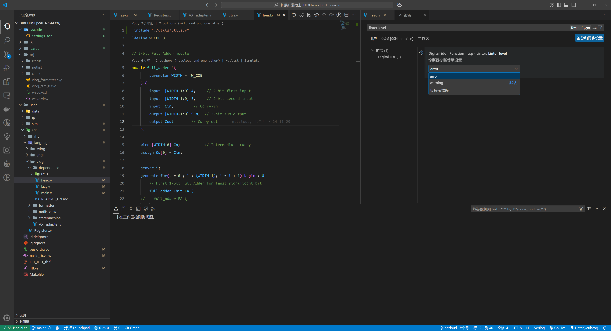
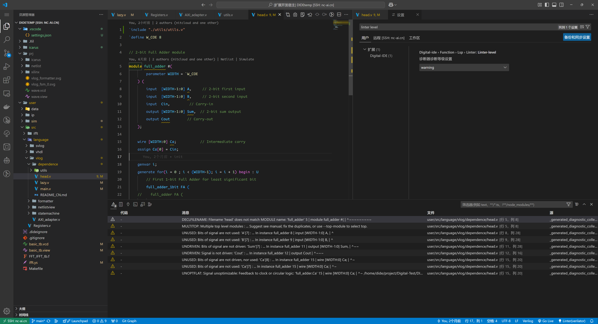
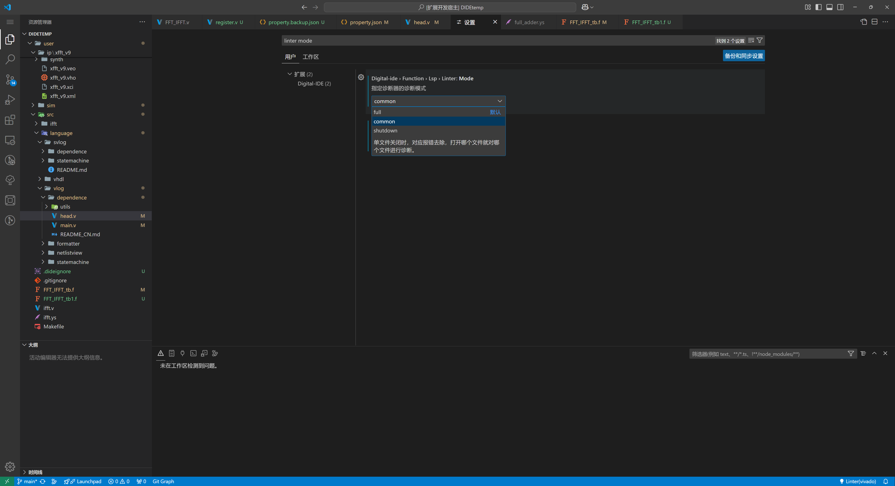

## 语法诊断

语法诊断可以在开发中提前帮助开发者了解到代码中隐藏的语法错误，在编译或者运行前提前规避部分错误，提高开发效率。

HDL 领域的社区内提供了不少的诊断工具，DIDE 也努力兼容了这些诊断工具，它们的基本信息和对各个 HDL 语言的支持情况如下表。

| 工具名称   | Verilog | SystemVerilog | VHDL |
|------------|---------|---------------|------|
| iverilog   | ✔️      | ❌            | ❌   |
| modelsim   | ✔️      | ✔️            | ✔️   |
| vivado     | ✔️      | ✔️            | ✔️   |
| verible    | ✔️      | ✔️            | ❌   |
| verilator  | ✔️      | ✔️            | ❌   |

> DIDE 自己的高速诊断器正在稳步推进中，不久就会上线

@[artPlayer](/videos/lsp/linter-introduction.mp4)

## 更换诊断器

### 方法一：点击 Status Bar Item

点击上图右下角的 status bar item，此时窗体上面会出现一个选择框，选择需要的诊断器即可。可用的诊断器会有灯泡的图标，并写上 【xxx 已经准备就绪】 的描述；不可用的诊断器会有警告的图标，并写上 【xxx 目前不可用】的标记。

### 方法二：在设置中配置

在设置中搜索 {hdl 语言 id} linter，找到对应选项卡，点击选择即可。如果点击选中了不可用的诊断器，右下角显示的诊断器 status bar item 会变成黄色，警告用户当前设置异常。

:::info
方法一和方法二的选项是相互绑定的，修改其中一个，另一个也会发生渲染和内部值上的变化。
:::

## 诊断器配置

对于部分第三方诊断器，为了让 DIDE 知道它的核心文件所在位置，从而进行调用，您需要：【将诊断器可执行文件加入环境变量】 或者 【配置诊断器安装路径】

### 配置诊断器安装路径

此处以 `verible` 为例，展示如何配置它的安装路径。当用户选择了`verible`，因为显示目前不可用，所以此时会跳出一个弹窗，询问用户：

点击配置安装目录，就会跳转到设置界面，填入安装目录的绝对路径：

下方的 output 中后端已经正确识别到了有效的工作负载，可以看到，工作负载是一个有效的可执行文件的绝对路径。此时`verible`上线。

:::info
对于部分诊断器，上面的这个弹窗除了提供一个跳转到【配置安装目录】的按钮，还会在它的左边提供一个【下载{诊断器ID}】的按钮，点击它会自动完成下载和路径的配置，但是需要注意，只有部分平台的部分诊断器会提供这个按钮，下载源我们不负任何责任。
:::

### 修改诊断等级 linter level

部分诊断器会报 warning ，比如 verilator，很多 warning 看着很烦人，这时候可以打开 setting，输入 linter level， 找到下面的选项：

- error: 只显示错误
- warning: 显示错误和警告

<Card title="error模式：只显示错误" icon="https://picx.zhimg.com/80/v2-d6eb33d06a512edcad625af79d5da7a4_1440w.png">

</Card>

<Card title="warning模式：显示错误和警告" icon="https://picx.zhimg.com/80/v2-d6eb33d06a512edcad625af79d5da7a4_1440w.png">

</Card>

### 修改诊断模式 linter mode

修改诊断模式在`设置`中搜索 `linter mode`，如下图：

选择适合的诊断模式：
- Full: 将所有设计源直接进行诊断，并报错，无论文件是否打开。
- Common: 单文件关闭时，对应报错去除，打开哪个文件就对哪个文件进行诊断。
- Shutdown: 全局关闭，即整个工程都不进行工程报错。（专心code）