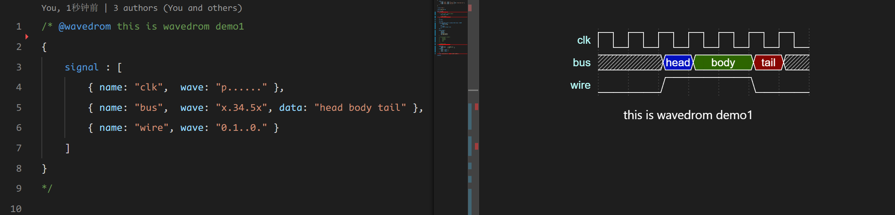

## CDF.1 - 5 代码文档化

DIDE 对于项目中的 vlog 和 vhdl 等文件，支持直接查看它们的文档，点击右上角的按钮即可查看。通过文档化，你可以快速了解当前 verilog 或者 vhdl 文件中 module 的基本信息和依赖信息。依赖信息也支持跳转。

@[artPlayer](/videos/code2doc.mp4)

## CDF.6 Wavedrom 注释

Wavedrom 是一种用于绘制数字时序图的工具，特别适合硬件设计和数字电路仿真。它使用简单的 JSON 格式来描述波形，并能在浏览器中实时渲染。Wavedrom 支持多种波形元素，如时钟、信号、总线等，广泛应用于文档编写和教学演示。

DIDE 也支持了在注释中编写 Wavedrom 风格的注释，并在文档化中渲染它们。Wavedrom 注释必须写成块状注释，并且必须在块状注释的第一行写上 `@wavedrom`，DIDE 会给与 Wavedrom 注释代码高亮方便用户编写需要演示的信号。一个例子如下：

```json
/* @wavedrom this is wavedrom demo1
{
    signal : [
        { name: "clk",  wave: "p......" },
        { name: "bus",  wave: "x.34.5x", data: "head body tail" },
        { name: "wire", wave: "0.1..0." }
    ]
}
*/
```

渲染效果：



更多 Wavedrom 的用法可以参考它们的教程：

<detail-url
    href="https://wavedrom.com/tutorial.html"
    logo="https://wavedrom.com/images/logo.svg"
    title="wavedrom.com"
    desc="Hitchhiker's Guide to the WaveDrom"
></detail-url>


## CDF.7 导出你的文档

DIDE 的文档化支持如下三种导出格式：

- markdown
- html
- pdf

@[artPlayer](/videos/exportpdf.mp4)

导出的文档默认都在项目的 `./doc` 下。

如果需要导出pdf，请将你本机的Google Chrome或者Edge浏览器的启动路径填入参数**markdown-pdf executable path**中。由于大部分pdf阅读器都不支持变色背景，请在浅色主题下导出你的pdf.

:::info
如果是 Windows 11 用户，默认不需要设置浏览器路径。因为 win11 自带的 edge 路径 `C:/Program Files (x86)/Microsoft/Edge/Application/msedge.exe` 是固定的。
:::
