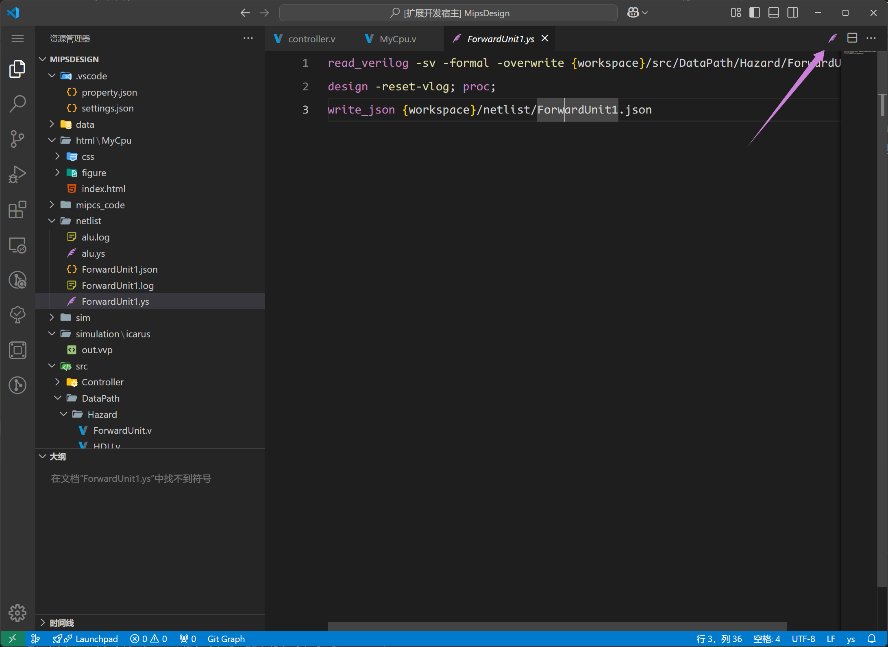

## Netlist 预览

我们在插件后端集成了yosys可执行文件（直接编译后的），这使得可以在不安装以及配置任何软件之下完成工程代码（仅限verilog和部分sv，具体支持见yosys官网）的综合，并能够展示出综合之后的网表图。使用方式非常简单，只需要在功能入口处点击，就能渲染出以当前模块为顶层的网表图，能帮助用户快速审查自己的代码设计。

Netlist 有两种方式进行触发。

### 启动方法一：Codelens

通过 module 上方的 `codelens` 的 Netlist，可以渲染当前 module 的 netlist。

如下图所示的，悬浮在模块命名上的`Netlist`按键功能入口

@[artPlayer](/videos/netlist/trigger-codelens.mp4)

### 启动方法二：模块树

在模块树中，你也可以查看某一个 module 的 netlist。

@[artPlayer](/videos/netlist/trigger-treeview.mp4)

## Netlist 基本使用

:::warning
0.4.0 的 netlist 仍然是一个完成度不高的作品。更多功能会在后续更新。
:::

@[artPlayer](/videos/netlist/usage.mp4)

## 手动执行 YS 脚本

我们还提供了对于 ys 的支持，你可以自己写好 ys 脚本后，使用 DIDE 来直接执行它。点击右上角的粉色羽毛图标即可执行当前的 ys 脚本。

