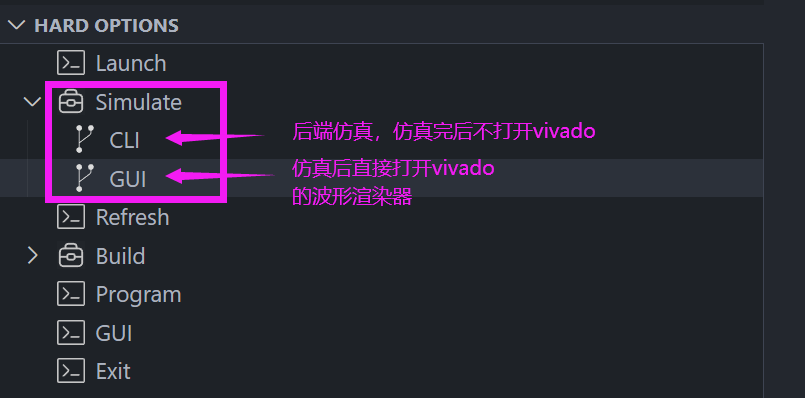
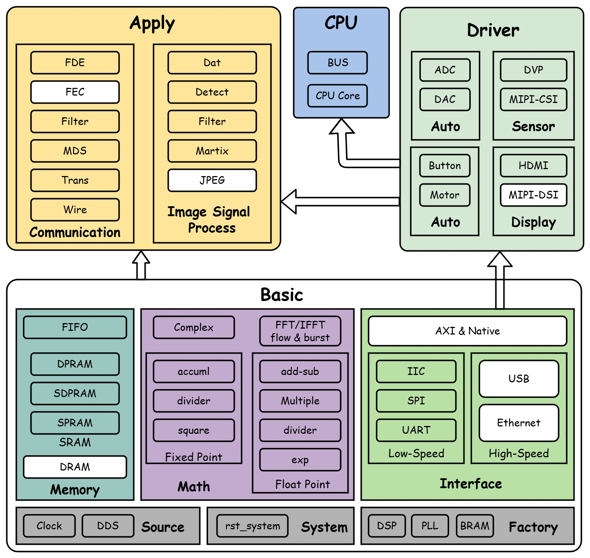

工程管理主要需要实现以下几个任务:

1. 工程搭建
  - Library Manager (IP & BD)
  - Project Manager (PS & PL)
2. 仿真搭建
  - Instances & AI for Generate tb file
  - Fast simulate & Generate simulation script
3. 设计辅助
  - Tree Structure
  - Code-Document
  - Netlist-View
  - Wave-View

<!-- ```mermaid
---
title: 工程管理(PM)
---
flowchart TB
    subgraph 工程搭建
    pm11(Library Manager IP & BD)
    pm12(Project Manager PS & PL)
    end
    subgraph 仿真搭建
    pm21(Instances & AI for Generate tb file)
    pm22(Fast simulate & Generate simulation script)
    end
    subgraph 设计辅助
    pm31(Tree Structure)
    pm32(Code-Document)
    pm32(Netlist-View)
    pm32(Wave-View)
    end
``` -->

---

## DIDE 项目配置

### 标准文件结构

DIDE 项目的配置核心在于 `property.json` 这个文件。一个名为 `PROJECT_NAME` 的项目的标准结构如下：

::: file-tree

- PROJECT_NAME
  - .vscode
    - property.json  工程配置文件 用户自定义 (或者存放于工作区的根目录也可)
  - prj  用于存放工程文件
    - simulation/  用于存放第三方仿真工具运行时的中间文件
    - factory/  用于存放原厂的工程文件 (如：xilinx，efinlix)
  - user  用于存放用户设计的源文件 用户自定义
    - ip/  用于存放工程ip代码 (厂商工具管理，但由插件搬移至src同级目录)
    - bd/  用于存放工程block design源码 (厂商工具管理，但由插件搬移至src同级目录)
    - data/  主要存放数据文件，以及约束文件
    - sim/  用于存放用户仿真代码
    - src/  用于存放用户的设计源码
      - lib/  用于存放用户的硬件库源码
    - sdk/  用于存放软件设计，对应xilinx的sdk的设计
:::

:::info 注
在此去除 Hardware 和 Software 的分开设计并进行合并；在 soc 的开发模式下只会在 user 下新增 sdk 的文件夹，从而简化整体工程管理设计。当插件检索不到对应工作区下有 `property.json` 文件时，则认为是无配置文件结构，工程管理系统内则做以下定义(即所有的检测都会到工作区下去寻找，此操作会导致插件运行卡顿，慎用)：

```json
"arch" : {
    "structure" : "null", // 内部配置，或者用户设置该字段在规定之外则默认设置为此
    "prjPath": "${workspace}/prj",
    "hardware" : {
        "src"  : "${workspace}", 
        "sim"  : "${workspace}",  
        "data" : "${workspace}" 
    },
    "software" : {
        "src"  : "${workspace}",
        "data" : "${workspace}" 
    }
},
```
:::


---

### 自定义文件结构

用户自定义文件结构由用户自行配置的`arch`属性来配置（具体配置方式见下一小节），并且此时`structure`类型必须要配置为`custom`。

:::info 注
当structure配置为非`custom`时其余属性均忽略，只使用指定的模式。若在三种模式之外的进行报错被认为使用的是用户模式，此时若无定义则将整个工作区进行解析。
:::

---

### 忽略文件设计 dideignore
为了更好的进行工程的自定义化在原有的管理系统上新增ignore设计。文件名定义为 `.dideignore` 该文件所包含的设计同 `.gitignore` 由文件或者文件夹带正则的相对路径或绝对路径组成；其中包含的HDL文件均忽略，不参与解析、渲染以及监控。参考书写如下：

```bash
# 忽略 user/src 文件夹下所有的文件，等同于 user/src/* 以及 user/src/
user/src

# 忽略 user/src 文件夹下所有的 .v 后缀的文件
user/src/*.v
```

:::info
ignore文件的优先级大于定义的文件路径，如果ignore中包含src的路径，那整个src都不会被添加到工程中进行解析、渲染以及监控等操作。
:::

---

### 配置文件定义

```json
// porperty.json 所有属性解说
{
    // 当前使用的第三方工具链
    "toolChain": "xilinx", 
    "toolVersion" : "2023.2.307",

    // 工程命名 
    // PL : 编程逻辑设计部分即之前的FPGA
    // PS : 处理系统设计部分即之前的SOC
    "prjName": {
        "PL": "template",
        "PS": "template"
    },

    // 自定义工程结构，若无该属性则认为是标准文件结构（详见下文说明）
    "arch" : {
        "structure" : "", // standard | xilinx | custom
        "prjPath" : "",   // 放置工程运行时的中间文件
        "hardware" : {    
            "src"  : "",  // 放置设计源文件，注: src上一级为IP&bd
            "sim"  : "",  // 放置仿真文件，会直接反应在树状结构上
            "data" : ""   // 放置约束、数据文件，约束会自动添加进vivado工程
        },
        "software" : {
            "src"  : "",  // 放置软件设计文件
            "data" : ""   // 放置软件相关数据文件
        }
    },

    // 代码库管理，支持远程和本地两种调用方式（详见下文库管理）
    // 使用UI来进行配置，不建议用户直接更改
    "library" : {
        "state": "", // local | remote
        "hardware" : {
            "common": [], // 插件提供的常见库
            "custom": []  // 用户自己的设计库
        }
    },

    // xilinx的IP仓库，直接添加到vivado的IP repo中
    // 目前支持ADI和ARM提供的IP repo （adi | arm）
    "IP_REPO" : [],

    // 当设计时用到PL+PS即为SOC开发
    // 当其中core不为none的时候即为混合开发
    "soc": {
        "core": "none",
        "bd": "",
        "os": "",
        "app": ""
    },
    
    "device": "none"
}
```

于工程路径配置需支持如下功能：
1. 所有属性均支持`${workspace}`、`${plname}`、`${psname}`
  - `${workspace}` ： 当前工作区的路径
  - `${plname}`、`${psname}` ：PL或PS的工程的名字
2. 支持相对路径的写法，如：`./user/src`
3. 支持路径字符的正则匹配

:::info
配置文件格式要做到后续版本一直兼容。同时去除更改配置文件从而更改文件结构的设计。
:::

---

## 标准功能入口

为了更好的兼容三方EDA的综合工具，目前定义通用设计接口如下：

1. Launch ------ 启动整个工程，如果没有工程则创建，有的话则直接打开
2. Refresh ----- 刷新整个工程，更新整个工程的设计
3. Simulate ---- 仿真整个工程，默认不打开GUI界面 *`（使用的是TOOL_CHAIN里的仿真器）`*
   1. SimGUI ----- 仿真成功后打开GUI界面
   2. SimCLI ----- 仿真成功后不打开GUI界面
4. Build ------- 构建整个工程，并最后输出bit流文件
   1. Synth ------ 进行工程的综合
   2. Impl ------- 进行工程的实现
   3. Bitstream -- 输出工程的bit流文件
5. Program ----- 比特流文件下载 *`（下载烧写，但不固化）`*
6. GUI --------- 打开工具链的GUI界面
7. Exit -------- 关闭工程。
   - 在点击`Exit`之后插件会将你的`IP和bd设计`移动`user/src/`目录下


在操作框外的还需要两个重要功能：
1. setSrcTop
  - 刷新树结构
  - 并在工具链中重新设置
2. setSimTop
  - 刷新树结构
  - 并在工具链中重新设置
3. Do simulation for current module
4. exportFilelist
  - 导出 *.f 文件包含该模块以及所有依赖的文件绝对路径

### Xilinx兼容性说明

本插件相当于重做vivado的UI，做到在不使用xilinx的IP和bd下用户无需打开vivado的GUI就能完成整个工程的创建、综合、实现、生成比特流以及下载。

#### 环境配置

首先你需要安装好vivado，并按如下图配置好vivado的安装路径：


这样的配置方式能很方便的帮助用户更换vivado的当前执行版本。

#### 构建你的工程

当你需要新建一个工程的时候，只需要进行如下三步操作：

1. 新建工程文件夹，并使用vscode打开这个文件夹。
2. 打开命令行，创建配置文件，设置你的设备编号。
3. 将相应代码拖动到相应的文件夹下。

此时你的工程就已经建好，具体参照视频如下：

@[artPlayer](/videos/pm/create-new-prj.mp4)

当你已经有一个标准xilinx的工程时，可以使用如下指令来进行一键转化。（转化前建议先备份）


标准xilinx工程特点如下：
1. 设计代码都在 {prjName}.srcs/sources_1/new 下
2. 约束代码都在 {prjName}.srcs/constrs_1/new 下
3. 仿真代码都在 {prjName}.srcs/sim_1/new 下
4. IP部分都在 {prjName}.srcs/sources_1/ip 下
5. bd部分都在 {prjName}.srcs/sources_1/bd 下

:::info
在完成转化之后需要直接重启vscode。避免执行不必要的解析。
:::

#### 使用vivado的仿真器进行仿真

具体操作如下图所示：


#### 综合实现以及导出比特流

根据上述的`标准功能入口`用户可以实现整个工程的综合实现以及导出比特流。其中launch主要是完成工程的搭建，在有工程的情况下会直接打开工程，在没有工程的情况下创建工程。

:::info
从`property.json`中所配置的`arch.prjPath`属性下配置的工程路径下找'.xpr'文件
  - 如果找到一个就直接打开，如果是多个交给用户选择再打开，如果是启用的GUI则直接打开vivado的界面。
  - 如果找不到就根据`property.json`中配置的内容来构建一个工程。
:::

具体使用如下图所示：


## 依赖结构渲染

结构树渲染，主要是展现工程的连接依赖的层级结构，其中以模块为基本单位，表述模块之间的层级关系。但是模块的属性比较复杂，并不只是一种类型；其可区分类型如下：
1. 文件分类，展示设计文件分区，当前分为设计区和仿真区，各区只包含对应文件夹下的模块。
2. 设计顶层，展示当前工程的顶层设计是哪一个模块，初始随机，后续由用户定义。
3. 仿真顶层，展示当前工程的仿真顶层是哪一个模块，初始随机，后续由用户定义。
4. 链接模块，展示哪些模块所在的文件是非本地的，一般都是库代码，插件定义。
5. 原语模块，展示哪些模块是原厂的原语模块。
6. IP代码块，展示IP的顶层模块，针对xilinx等原厂IP模块。

说明讲解：
特殊地，对于原语模块和IP代码模块无需点击跳转，但对于图标说明如下：
- 对于原语模块，如 IBUFDS 等（其余的见上查询连接）需要使用 celllib 的图标。
- 对于IP代码模块，需要到 ip 文件夹 下找有没有同名文件夹，有同名文件夹就需要使用相应的图标。

更新事件触发：
1. 工作区下，在vscode中有文件/文件夹的新增、删减以及重命名时结构树更新事件触发。
2. 工作区下，在文件管理器中有文件/文件夹的新增、删减以及重命名时结构树更新事件触发。
3. `property.json`文件变动时结构树更新事件触发，主要是针对文件结构和库文件变动的更新。
4. 工作区下，在vscode中有hdl文件文件内容更新时，针对那个文件内容的相关信息进行更新。

## 库管理系统

:::warning
库管理系统仍然在开发中，未来会逐步发生需求变更。
:::

库管理系统，帮助用户快速将插件提供的、三方提供的或者用户自己设计的IP库导入到整个工程设计中去，能帮助用户快速搭建出一个可用的工程模板，使得用户更加关注业务层的设计。因此对于库管理系统定义设计如下：

### 设计库导入的方式
1. 界面引导导入 （推荐）
2. 属性文件配置



### 导入的IP库的类型
1. local   [本地导入]
2. remote  [远程链接]（推荐）

:::info 注
此处之所以会分两种设计类型，一个是remote设计能轻量化工程设计源，达到快速分发的目的。另一方面，在remote的时候，如果对IP库代码进行了修改，会被永久更改，这是不建议的。
:::

因此在此支持local导入类型。local导入类型能将IP库代码直接复制到本地，可供用户直接修改，并不影响其他调用IP库的工程。

### IP库的导入来源

```mermaid
flowchart TD
    A[IP库的导入来源] --> B[插件后端提供]
    A --> C[IP供应商提供]
    A --> D[用户自己设计]
    B --> E(source path)
    C --> F(cloud platform)
    D --> G(costumer path)
```

界面导入方式如下所示：
@[artPlayer](/videos/pm/import-library.mp4)

### 用户库设置

用户设置自己平时常用库的路径：


导入用户库的方式：

