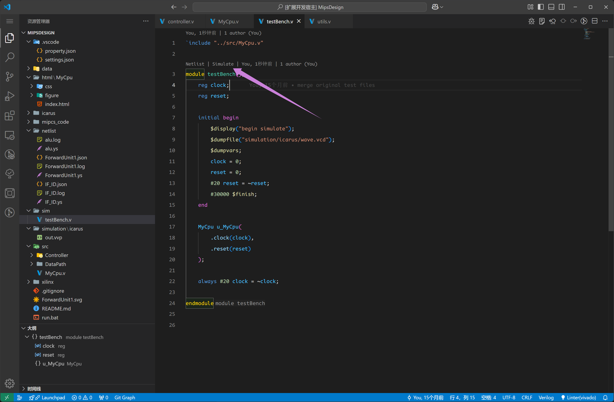
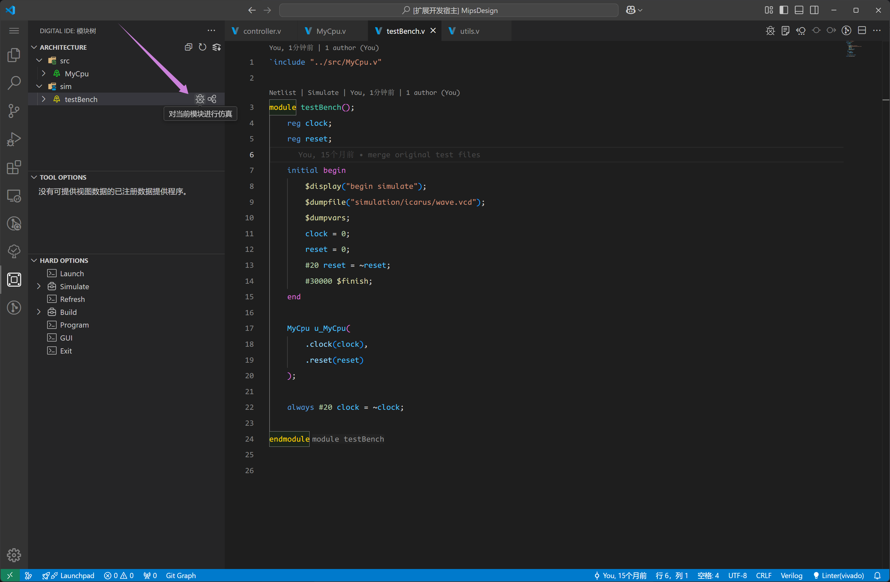
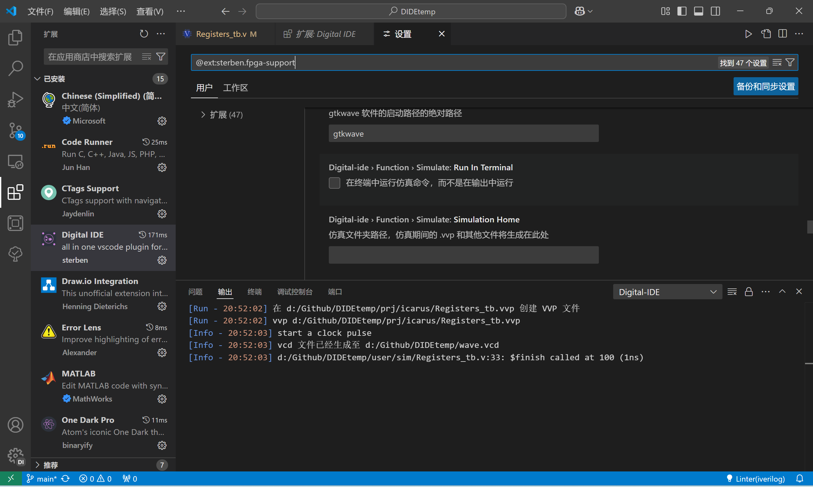

仿真搭建的目的是帮助用户能快速搭建起自己的仿真框架，并快速的获得仿真结果。

## iverilog

当前针对小模块的快速验证，我们给出了一个一键快速仿真的功能，该功能依赖的是`iverilog`来完成的。因此用户需要自己配置好`iverilog`的安装。

对于0.4.0最新版来说，我们对include做了专门的设计，无论写不写include都能正常仿真，但我们强烈不建议写include，include本身的设计会导致更高的复杂度，导致运行的不稳定性。

初期配置时，安装好`iverilog`，并将其配置到系统环境下，或者在setting中配置其安装路径。


## 快速仿真

快速仿真的触发方式有两种。一种通过 `codelens` 的行间字符，一种通过模块树的按钮。

### SF.1 通过 codelens 进行快速仿真

如下图所示的，悬浮在模块命名上的`Simulate`按键功能入口



### SF.2 通过 模块树 进行快速仿真

如下图所示的依赖结构中的功能入口



点击快速仿真之后，如果生成了 vcd 文件， DIDE 会自动打开对应的波形渲染器：

@[artPlayer](/videos/vcd/trigger-simulate.mp4)


### 常见问题

<Card title="没有生成 vcd 文件" icon="https://picx.zhimg.com/80/v2-d6eb33d06a512edcad625af79d5da7a4_1440w.png">

如果运行的过程中没有报错，那可能是tb文件中缺少生成vcd波形文件的语句：

```verilog
initial begin
    $dumpfile("prj/icarus/FFT_IFFT.vcd");        
    $dumpvars(0, FFT_IFFT_tb);
    #2000 $finish();
end
```

</Card>

<br>


<Card title="生成的 vcd 文件在哪里？" icon="https://picx.zhimg.com/80/v2-d6eb33d06a512edcad625af79d5da7a4_1440w.png">

当你在项目中使用 `dumpfile` 指定导出路径时，这个路径的根路径是你的工作目录。比如对于下面的文件结构：


::: file-tree

- PROJECT_NAME
  - .vscode
    - property.json
  - user
    - sim/
      - test.v
    - src/
:::

test.v 文件内容

```verilog
module test();
    initial begin
        $dumpfile("prj/test.vcd");        
        #2000 $finish();
    end
endmodule
```

那么，生成的 vcd 就在根目录下的 `prj/test.vcd` 也就是下面这个文件结构：

::: file-tree

- PROJECT_NAME
  - .vscode
    - property.json
  - prj
    - test.vcd
  - user
    - sim/
      - test.v
    - src/
:::

</Card>

<br>

<Card title="直接卡死，毫无输出" icon="https://picx.zhimg.com/80/v2-d6eb33d06a512edcad625af79d5da7a4_1440w.png">

如果运行的过程中没有报错，那可能是tb文件中缺少`$finish();`，强烈不建议这么做，这样做vcd会不断变大，后端iverilog也会卡住进程。需要在设计中加入一个`$finish();`来完善整个验证设计。

</Card>

<Card title="无法 simulate 且没有报错内容" icon="https://picx.zhimg.com/80/v2-d6eb33d06a512edcad625af79d5da7a4_1440w.png">

快速仿真功能报错时：
1. 去掉代码中的include部分
2. 下调iverilog的版本为11，或者如图直接群文件下载win版
后续会修复此问题，上面是过渡方案
3. 如下图所示，在DIDE设置中不要选择 `run in terminal`

</Card>

