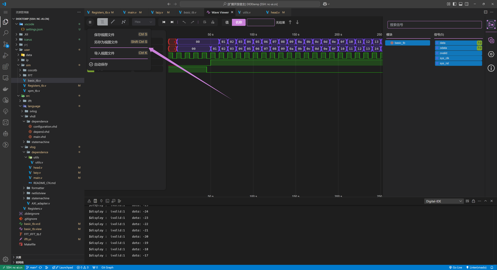

DIDE 提供了强大的波形查看器，能够解析大部分标准下的 vcd 并提供视图查看并提供了丰富的功能。

## VF.1 打开 vcd 查看器

选中一个 vcd 文件即可直接查看。

@[artPlayer](/videos/vcd/trigger-click.mp4)

## VF.2 视图文件

DIDE 的 vcd 查看器默认会生成用户查看的 vcd 文件的**视图文件**（同目录下同名的 `.view` 文件）。每当用户重新打开 vcd 文件时， DIDE 会根据视图文件自动还原出用户上一次打开的波形、打开的右侧视窗、建立的分组、为每一个信号进行的设置等等上下文信息。

如果不希望 DIDE 生成视图文件，可以在点击右上角的按钮，并取消【自动保存】。除此之外，你还可以为同一个文件保存多个视图文件，并在 DIDE 中同时打开它们，这在进行大规模 vcd 验证时非常有用。

## VF.3 配合快速仿真

如果您的 verilog 代码中能够正确执行导出 vcd 的操作，那么当快速仿真结束后， DIDE 会自动把生成的 vcd 打开并渲染。

@[artPlayer](/videos/vcd/trigger-simulate.mp4)

## VF.4 - VF.10 更多的功能

DIDE 的 vcd 查看器还支持进制转换，信号拖拽，信号分组，建立相对坐标轴等等其他功能。更多的其他功能正在更新中。

@[artPlayer](/videos/vcd/usage.mp4)

<!-- ## 特性支持

### VF.1 打开 vcd

vcd 可以作为 vcd 文件的默认打开方式。

### VF.2 仿真后自动打开

如果快速仿真打开了新的 vcd 文件，DIDE 会自动把它打开。

### VF.3 

### VF.4 

### VF.5 

### VF.6 

### VF.7 

### VF.8  -->
