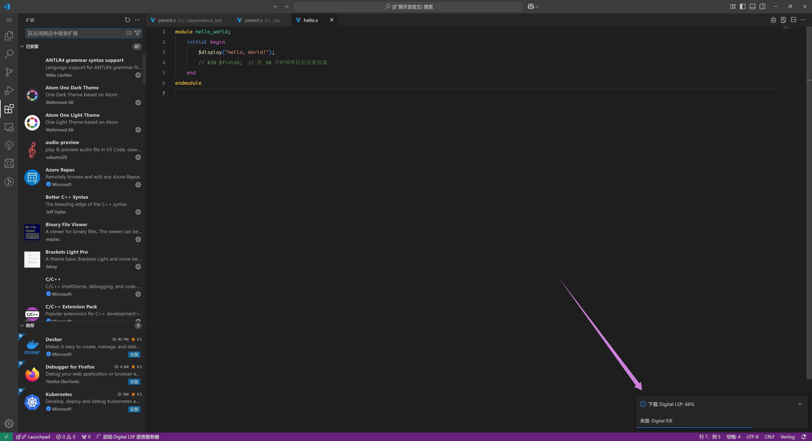
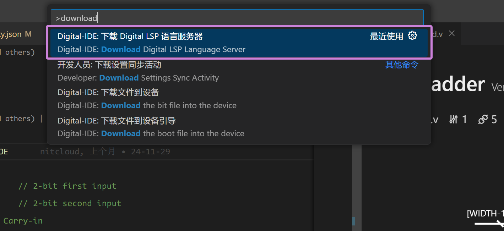
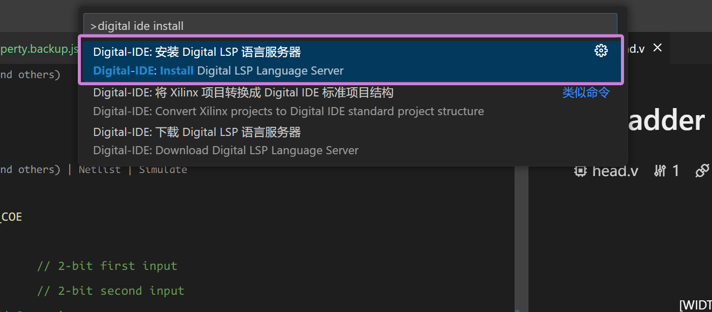
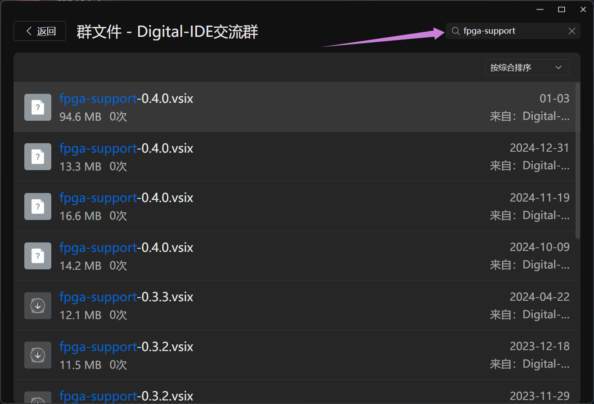
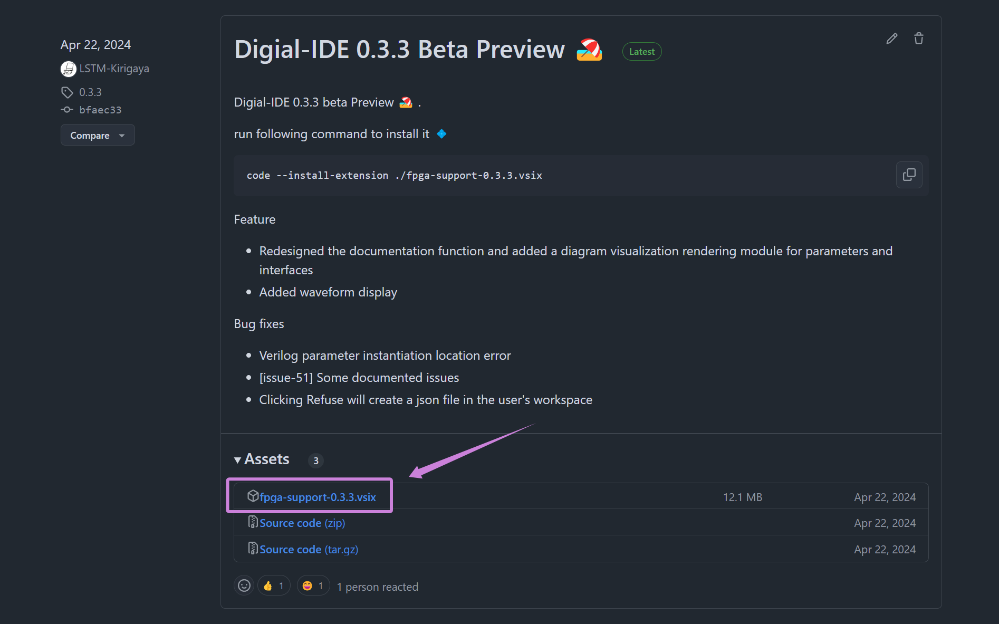

## 从 Vscode 安装

在 Vscode 插件商店中搜索 "Digital IDE" ，点击下载即可。

> 注：本插件是下载即用，无需做任何环境，除非需要其他三方工具（如：vivado、iverilog等）时，要自行安装软件。

@[artPlayer](/videos/quick-start/install-from-vscode.mp4)

### 在线安装 lsp（自动）

下载完成后，如果你当前目录中存在任何 HDL 文件（`.v`, `.sv` 或者 `.vhd` 结尾的文件），DIDE 就会自动启动。如果当前版本的 DIDE 在目标计算机上第一次启动，则会在启动时自动下载 `digital-lsp` ，如下图所示：

这是 DIDE 用于解析 HDL 文件并提供语言服务的核心负载。没有它，DIDE 绝大部分的功能将会下线。我们提供了国内国外两个下载源，理论上，大部分地区都可以稳定且愉快地下载 `digital lsp`。

### 在线安装 lsp（手动）

digital lsp 的主版本不一定和 DIDE 是同步的，如果对于同一个版本（比如 0.4.0），您想要体验最新的 digital lsp，那么可以手动下载。打开 vscode，按下 `F1`，输入 `download` 后，找到下图这个指令：

这将会下载最新的 digital lsp 并部署到 DIDE 中。

### 离线安装 lsp（手动）

如果你的执行环境为公司内网或者其他无法访问到，就要离线下载 lsp。先从我们提供的仓库中根据你目标计算机的操作系统+芯片架构，下载对应版本的 lsp. 我们提供了两个仓库源，我们保证这两个仓库的版本同步：

- Github: https://github.com/Digital-EDA/Digital-IDE/releases/tag/\{版本\}
- Gitee: https://gitee.com/Digital-IDE/Digital-IDE/releases/tag/\{版本\}

比如你的目标计算机是 x86 的 Windows（绝大部分的国内工作机），那么就选择带有 `windows` 和 `amd64` 的压缩包下载：

拷贝到目标计算机上后，按下 `F1`，输入 `install` 后，找到下图这个指令：

在打开的文件浏览器中，找到之前下载拷贝过来的 压缩包 安装即可。安装后重启 vscode 即可完成。

:::info
如果遇到任何问题，欢迎进入我们的 QQ 群 (932987873) 向我们咨询 
:::

## 安装最新测试版

在我们团队的努力下，DIDE 常年处在更新状态，Vscode 商城中下载到的版本可能和我们最新的版本存在很多差异。如果您想使用我们插件的最新测试版，您可以通过以下方式获得最新版本的 vsix 文件:

:::info 方法一：从QQ群文件下载
加入我们的 QQ 讨论群(932987873)，并在群文件，搜索 `fpga-support`，点击更多，选择最新版本（也就是最上面的）下载即可。

:::

:::info 方法二：从Release下载
从 DIDE 的 Github [releases](https://github.com/Digital-EDA/Digital-IDE/releases) 下载 `fpga-support-{version}.vsix` .

我们建议您能加入我们群聊，加入群聊有以下好处：
1. 能最新体验到新的版本，相比正式版本，群内测版会提前3-4月上线进行内测。
2. 可以快速解决您现在遇到的问题。
3. 对于您提出的需求能得到最快速的响应。
:::

下载得到了 vsix 文件后按照如下步骤安装：

@[artPlayer](/videos/quick-start/install-from-vsix.mp4)
